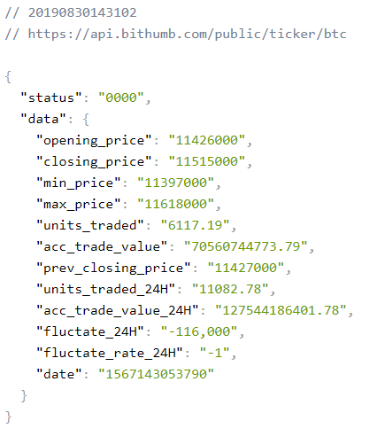

# 190830 Python

## 1. 파이썬 설치하기

1. https://www.python.org/downloads/windows/에서 Download Windows x86-64 executable installer 다운로드

2. Add Python 3.7 to PATH 체크하고 Install Now로 설치

-----------

## 2. 파이썬 명령어 알아보기

```python
# ctrl + n 새 파일
# cyrl + s hello.py
print('happy hacking!')

name = '하진'
print(name)

name = 123
print(name)

name = True
print(name)

# 리스트
my_list = ['하진', 123, True, '하이']
type(my_list) #type() : 타입을 알아보는 함수
print(my_list[0])

#딕셔너리(해시) : 키랑 밸류로 이루어진!
my_dict = {'하진': 28, '홍길동': 600}
print(my_dict['하진'])
print(my_dict['홍길동'])

# 조건
a = 5
if a>0:
    print('양수')
else:
    print('음수')


#반복
a = [1, 3, 5, 6]
for num in a:
    print(num)

name = '홍길동'
for char in name:
    print(char)
```


------------

## 3. 파이썬으로 API 제이슨 객체로 받아오기

API : 프로그래밍으로 무언가에 접근을 해서 정보를 가져오겠다 라고 할 때 사용하는 인터페이스

- api.py 생성

```python
# 1. requests 라이브러리 가져오기
import requests

# 2. url 요청을 보내서
url = 'https://api.bithumb.com/public/ticker/btc'

# 3. 값을 받아온다.
response = requests.get(url).json()
print(response)
print('--------------------------------------')
print(response['data']['max_price'])
```

```
$ student@M5038 MINGW64 ~/Desktop/python
$ python api.py
```


`pip` : 외부 패키지를 설치할 수 있는 명령어

- 크롬웹스토어 > JSON Viewer 설치 하면 크롤링한 json객체를 일목요연하게 볼 수 있다.
  - https://api.bithumb.com/public/ticker/btc URL 타고 들어간 화면




## 4. 챗봇 API

https://desktop.telegram.org/에서 텔레그램 다운로드


1. chatbot폴더 만들고 .env, .gitignore 파일 생성

```bash
student@M5038 MINGW64 ~/Desktop/chatbot
$ pip install python-decouple
Collecting python-decouple
  Downloading https://files.pythonhosted.org/packages/9b/99/ddfbb6362af4ee239a012716b1371aa6d316ff1b9db705bfb182fbc4780f/python-decouple-3.1.tar.gz
Installing collected packages: python-decouple
  Running setup.py install for python-decouple ... done
Successfully installed python-decouple-3.1
You are using pip version 19.0.3, however version 19.2.3 is available.
You should consider upgrading via the 'python -m pip install --upgrade pip' command.

student@M5038 MINGW64 ~/Desktop/chatbot
$ touch .env

student@M5038 MINGW64 ~/Desktop/chatbot
$ touch .gitignore
```


2. .env와 .gitignore의 내용을 다음과 같이 설정

- .env (.env를 통해 환경변수를 관리한다.)

```
NAVER_CLIENT_ID="r6Id7tQn_ghoYBET2NSW"
NAVER_CLIENT_SECRET="fo0V6RDK3n"
```

- .gitignore

```
.env
```


3. papago.py 생성후 다음과 같이 설정

```python
import requests
from decouple import config
import pprint

# 1. 환경변수 설정 : env에 키를 환경변수를 저장하고 gitignore로 env는 안올라가게 설정해놓았기 때문에 github 상에는 key가 안올라간다!
naver_client_id = config('NAVER_CLIENT_ID')
naver_client_secret = config('NAVER_CLIENT_SECRET')
print(naver_client_id)

# 2. URL 설정
url = 'https://openapi.naver.com/v1/papago/n2mt'

# 3. 헤더 및 data 설정
headers = {
    'X-Naver-Client-Id': naver_client_id,
    'X-Naver-Client-Secret': naver_client_secret
}

data = {
    'source': 'ko',
    'target': 'en',
    'text': '댕댕이'
}

# 4. 요청
#url에 헤더와 데이터를 포함해서 POST 요청을 보내고 
# 그 결과(json)를 파싱
response = requests.post(url, headers=headers, data=data).json()

#json 정리해서 print하게 해주는 pprint 활용
pprint.pprint(response)
print(response['message']['result']['translatedText'])

```


설치한 텔레그램 들어가서 가입하고 @BotFather 들어가기

/newbot으로 bot 생성


### 1) url을 통해 챗봇으로 메시지 보내기

https://core.telegram.org/bots/api > Making Requests > https://api.telegram.org/bot<token> 복사

token에 BotFather생성하면서 알려준 키값(637873701:AAFDEeJfZOfl8skV1kg5RHr8FZ0tXwre5dc) 넣기


- 내 정보 보기 getMe

 https://api.telegram.org/bot637873701:AAFDEeJfZOfl8skV1kg5RHr8FZ0tXwre5dc/getMe

```
// 20190830154344
// https://api.telegram.org/bot637873701:AAFDEeJfZOfl8skV1kg5RHr8FZ0tXwre5dc/getMe

{
  "ok": true,
  "result": {
    "id": 637873701,
    "is_bot": true,
    "first_name": "openapi-b",
    "username": "downer92_bot"
  }
}
```


- 챗봇한테 메시지 한번 보내고나서 getUpdates

 https://api.telegram.org/bot637873701:AAFDEeJfZOfl8skV1kg5RHr8FZ0tXwre5dc/getUpdates

```
// 20190830155046
// https://api.telegram.org/bot637873701:AAFDEeJfZOfl8skV1kg5RHr8FZ0tXwre5dc/getUpdates

{
  "ok": true,
  "result": [
    {
      "update_id": 6418818,
      "message": {
        "message_id": 1,
        "from": {
          "id": 903718757,
          "is_bot": false,
          "first_name": "Neutron",
          "last_name": "Jimmy"
        },
        "chat": {
          "id": 903718757,
          "first_name": "Neutron",
          "last_name": "Jimmy",
          "type": "private"
        },
        "date": 1567147834,
        "text": "/start",
        "entities": [
          {
            "offset": 0,
            "length": 6,
            "type": "bot_command"
          }
        ]
      }
    },
    {
      "update_id": 6418819,
      "message": {
        "message_id": 2,
        "from": {
          "id": 903718757,
          "is_bot": false,
          "first_name": "Neutron",
          "last_name": "Jimmy",
          "language_code": "ko"
        },
        "chat": {
          "id": 903718757,
          "first_name": "Neutron",
          "last_name": "Jimmy",
          "type": "private"
        },
        "date": 1567147836,
        "text": "';';"
      }
    }
  ]
}
```


- 메시지 보내기 sendMessage

https://api.telegram.org/bot637873701:AAFDEeJfZOfl8skV1kg5RHr8FZ0tXwre5dc/sendMessage?chat_id=903718757&text=안녕

```
// 20190830155204
// https://api.telegram.org/bot637873701:AAFDEeJfZOfl8skV1kg5RHr8FZ0tXwre5dc/sendMessage?chat_id=903718757&text=%EC%95%88%EB%85%95

{
  "ok": true,
  "result": {
    "message_id": 3,
    "from": {
      "id": 637873701,
      "is_bot": true,
      "first_name": "openapi-b",
      "username": "downer92_bot"
    },
    "chat": {
      "id": 903718757,
      "first_name": "Neutron",
      "last_name": "Jimmy",
      "type": "private"
    },
    "date": 1567147916,
    "text": "안녕"
  }
}
```


### 2) 코드를 활용해서 챗봇으로 메시지 보내기

- .env에 토큰정보 추가

```
NAVER_CLIENT_ID="r6Id7tQn_ghoYBET2NSW"
NAVER_CLIENT_SECRET="fo0V6RDK3n"
TELEGRAM_TOKEN="637873701:AAFDEeJfZOfl8skV1kg5RHr8FZ0tXwre5dc"
```


- bot.py

```python
import requests
from decouple import config

# 1. 토큰 값 설정
token = config('TELEGRAM_TOKEN')


# 2. url 설정
# chat_id, text 요청변수 설정!

# string interpolation : 문자열 내에 변수값 삽입 / f'OOOO{변수값}'의 형태
base_url = f'https://api.telegram.org/bot{token}'
chat_id = 903718757
text = '안뇽안뇽'
url = f'{base_url}/sendMessage?chat_id={chat_id}&text={text}'


# 3. 메시지 보내기
requests.get(url)
```


### 3) 챗봇으로 로또번호를 매주 금요일마다 보내기

- bot.py

```python
import random
import requests
from decouple import config
# 0. 로또 번호 추출
numbers = range(1, 46)
text = sorted(random.sample(numbers, 6))


# 1. 토큰 값 설정
token = config('TELEGRAM_TOKEN')


# 2. url 설정
# chat_id, text 요청변수 설정!

# string interpolation : 문자열 내에 변수값 삽입 / f'OOOO{변수값}'의 형태
base_url = f'https://api.telegram.org/bot{token}'
chat_id = 903718757
url = f'{base_url}/sendMessage?chat_id={chat_id}&text={text}'


# 3. 메시지 보내기
requests.get(url
```


-----------

## 5. Herku CLI (배포 관련)

- visual studio code에서

```
$ pip freeze > requirements.txt
$ pip install -r requirements.txt => 이 안에 있는 것들을 다 긁어서 설치해줌
git add .
$ git commit -m 'heroku setting'
```


- chatbot 폴더에서 bash로

```
heroku login
heroku create downer92-chatbot
```


- heroku > downer92-bot > settings > Config Bars 에서 chatbot token 숫자는 key 문자열은 value에 넣기

- overview > Configure Add-ons > Add-ons > Heroku Scheduler > create jobs

  => job을 통해 메시지를 주기적으로 보낼 시간을 설정할 수 있다.