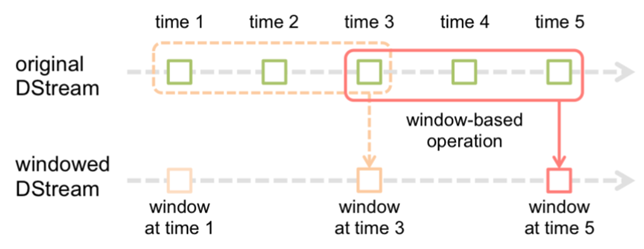

# 190904 Spark

## I. 스파크 Streaming

#### 스파크 Streaming

- 단순히 주어진 데이터를 읽고 처리하는 것뿐만 아니라 시간의 흐름에 따라 꾸준히 변화하는 데이터를 다루기 위한 것

- adhoc 방식, 실시간 처리
  - 예) 온라인 쇼핑몰이나 웹사이트에 대한 악의적인 접근 시도를 판단하기 위한 데이터라든가 시민들에게 환경 오염이나 교통 흐름 정보를 알려주기 위한 목적으로 취합한 데이터는 시간이 지난 후에 처리하면 그 가치가 크게 떨어지므로 최대한 빠른 시간 안에 데이터를 분석하고 그 결과를 산출할 수 있어야 한다.

- 실시간으로 변화하는 데이터를 (배치 처리보다) 짧은 주기에 맞춰 빠르고 안정적으로 처리하는 데 필요한 기능을 제공하는 스파크 모듈
  - 예) 시시각각으로 변하는 날씨 데이터라든가 웹 서버의 접속 로그와 같은 것들이 스트리밍 데이터로 취급될 수 있다.

- 짧은 주기의 배치 처리를 통해 이전 배치와 다름 배치 사이의 데이터 크기를 최소화하는 방법으로 스트리밍 데이터를 다루며, 각각의 배치 작업 사이에 새로 생성된 데이터가 하나의 RDD로 취급되어 처리됩니다.

- 스파크 스트리밍은 일정한 주기마다 새로운 RDD를 읽어와서 그 이전에 생성했던 RDD 처리 결과와 혼합해서 필요한 처리를 수행하는 행위를 애플리케이션이 종료될 때까지 무한히 반복하는 형태로 동작한다.

- 스트리밍 컨텍스트 (StreamingContext)인스턴스 생성 – SparkConf 또는 SparkContext를 이용해서 생성, 어떤 주기로 배치 처리를 수행할지에 대한 정보를 함께 제공해야 한다.

  ```scala
  import org.apache.spark.streaming.{Seconds, StreamingContext}
  import org.apache.spark.{SparkConf, SparkContext}
  import scala.collection.mutable.Queue
  
  val conf = new SparkConf() .setMaster("local[*]").setAppName("SteamingSample")    
  val sc = new SparkContext(conf)    
  val ssc = new StreamingContext(sc, Seconds(3))    
  
  val rdd1 = sc.parallelize(List("Spark Streaming Sample ssc"))    
  val rdd2 = sc.parallelize(List("Spark Quque Spark API"))    
  val inputQueue = Queue(rdd1, rdd2)    
  val lines = ssc.queueStream(inputQueue, true)    
  val words = lines.flatMap(_.split(" "))   
   words.countByValue().print()    
  ssc.start()    
  ssc.awaitTermination
  ```

  

- 스트리밍 컨텍스트 (StreamingContext)는 명시적인 시작(start)과 종료(stop), 대기(awaitTermination) 메서드를 사용해야 한다.

- 스트리밍 애플리케이션의 특성상 명시적인 종료 메시지나 에러가 없다면 애플리케이션이 임의로 종료되지 않아야 하므로 start()를 호출한 다음 awaitTermination()를 호출해 애플리케이션이 종료되지 않게 해야 한다.

- 스트리밍 컨텍스트는 단 한번 시작되고 종료됩니다. (한번 종료한 스트리밍 컨텍스트를 다시 재시작할 수 없다.)

- 스트리밍 컨텍스트는 한번 시작되고 나면 더 이상 새로운 연산을 정의하거나 추가할 수 없다.

- JVM당 오직 하나의 스트리밍 컨텍스트만 동시에 활성화될 수 있다.

- 스트리밍 컨텍스트의 stop() 메서드를 호출하면 연관된 SparkContext도 함께 중지된다. 

- 스트리밍 컨텍스트만 종료하고 싶다면 stop() 메서드의 stopSparkContext 매개변수 값을 false로 지정하면 된다.

- 한 번에 하나의 스트리밍 컨텍스트만 동작한다는 가정하에 하나의 스파크 컨텍스트로부터 여러 개의 스트리밍 컨텍스트를 생성할 수 있다.


#### Dstream(Discretized Stream)

- 고정되지 않고 끊임없이 생성되는 연속된 데이터를 나타내기 위한 추상 모델

- 데이터스트림을 처리해서 일정 시간마다 데이터를 모아서 RDD를 만드는데 이러한 RDD로 구성된 시퀀스

- 마지막 데이터를 읽어들인 시점으로부터 배치 간격에 해당 하는 시간 동안 새로 생성된 데이터를 읽어들여 새로운 RDD를 생성 

  


#### 기본 데이터 소스

- 외부 라이브러리의 도움 없이 스파크 단독으로 지원 가능

- 소켓, 파일, RDD 큐

#### 어드밴스드 데이터 소스

- 카프카(Kafka), 플럼(Flume), 키니시스(Kinesis), 트위터(Twitter)

> 스파크가 제공하는 Receiver 추상 클래스를 상속받아 사용자 정의 데이터 소스를 사용할 수 있다.


#### 데이터 읽기

- TCP 소켓을 이용해 데이터를 수신하는 경우 서버의 IP와 포트 번호를 지정해 스파크 스트리밍의 데이터 소스로 사용할 수 있다.

- socketTextStream() – 소켓을 통해 문자열 데이터를 수신

- socketStream() – 소켓을 통해 문자열이 아닌 데이터를 수신  

  ```scala
  import org.apache.spark.SparkConf
  import org.apache.spark.streaming.{Seconds, StreamingContext}
  
  object SocketSample {
    def main(args: Array[String]): Unit = {
  
      val conf = new SparkConf().
        setMaster("local[3]")
        .setAppName("SocketSample")
      val ssc = new StreamingContext(conf, Seconds(3))
      val ds = ssc.socketTextStream("localhost", 9000)
      ds.print
      ssc.start()
      ssc.awaitTermination()
    }
  }
  ```

  

- 데이터 소스로 파일을 사용할 경우 fileStream()를 사용합니다.

- 모든 파일시스템 유형을 지원

- textFileStream() – 데이터 형식이 문자열일 경우 사용

- 파일의 변경 내용을 추적하는 것은 아니며 동일한 디렉토리에 있는 파일은 모두 같은 형식을 가져야 한다.

- 스트리밍 컨텍스트가 생성 중이거나 이동 중인 파일에 접근하면 안 됩니다. 파일은 항상 atomic 방식으로 생성되고 이동해야 한다.

- 한번 생성된 파일은 변경돼서는 안된다.


- RDD로 구성된 Queue를 이용해 Dstream을 만들 수 있다.

- 테스트 케이스를 작성하거나 Dstream이 제공하는 다양한 연산을 테스트하고 학습하는 용도로 많이 사용하는 방법

- 테스트에 사용할 데이터로 RDD를 만들고 이 RDD들로 구성된 scala.collection.mutable.Queue를 스트트리밍 컨텍스트의 queueStream() 의 매개변수로 지정해 Dstream을 생성한다.

  ```scala
  import scala.collection.mutable
  val rdd1 = ssc.sparkContext.parallelize(List("a", "b", "c"))
  val rdd2 = ssc.sparkContext.parallelize(List("c", "d", "e"))
  val queue = mutable.Queue(rdd1, rdd2)
  val ds = sc.queueStream(queue) 
  ```

  

#### 카프카

- 카프카(Kafka)는 높은 성능과 안정성을 보장하는 분산 메시징 시스템

- 카프카 시스템은 데이터를 제공하는 프로듀서(Producer)와 데이터를 사용하는 컨슈머(Consumer), 데이터 저장과 관리를 담당하는 브로커(Broker)로 구성

- 카프카 서버에 데이터를 저아하는 클라이언트(Producer)와 읽기 연산을 수행하는 클라이언트(consumer)로 구성

- 브로커(Broker) 서버는 토픽이라는 개념을 이용해 토픽 단위로 데이터를 분류해서 저장하며 컨슈머 역시 동일한 토픽 단위로 데이터를 읽어갈 수 있다.

- 브로커(Broker) 서버가 데이터를 저장할 때는 토픽 단위로 분리한 데이터를 다시 여러 개의 파티션으로 분리해서 저장하는데 카프카의 브로커 서버가 서버의 대수와 무관하게 무조건 클러스터를 구성하도록 돼 있기 때문에 각 파티션은 클러스터에 분산되어 저장된다.

- 각 파티션은 클러스터를 구성하고 있는 여러 브로커 서버에 나누어 저장되고 복제 정책에 따라 하나의 파티션이 다수의 서버에 복제된다.

- 클러스터 간 데이터를 복제하기 위해 주키퍼 서버를 사용하므로 카프카를 사용할 때 반드시 주키퍼 서버도 함께 구성해야 한다.

- 스파크 스트리밍에서는 카프카와 연동할 수 있는 두가지 API를 제공
  - 데이터를 수신을 위한 리시버를 사용하는 방법 – KafkaUtils.createStream() 사용
  - 카프카에 특화된 API – 카프카로부터 수신하는 데이터는 애플리케이션 장애가 발생하더라도 정확히 한번 처리되는 것을 보장 , KafkaUtils.createDirectStream() 사용

  ```scala
  import kafka.serializer.StringDecoder
  import org.apache.spark.streaming.{Seconds, StreamingContext}
  import org.apache.spark.{SparkConf, SparkContext}
  object KafkaSample {
    def main(args: Array[String]) {    
      import org.apache.spark.streaming.kafka._
      val conf = new SparkConf()
        .setMaster("local[*]")
        .setAppName("KafkaSample")
      val sc = new SparkContext(conf)
      val ssc = new StreamingContext(sc, Seconds(3))
      val zkQuorum = "localhost:2181"
      val groupId = "test-consumer-group1"
      val topics = Map("test" -> 3)    
      val ds1 = KafkaUtils.createStream(ssc, zkQuorum, groupId, topics)
      val ds2 = KafkaUtils.createDirectStream[String, String, StringDecoder, StringDecoder](ssc, 
          Map("metadata.broker.list" -> "localhost:9092"), 
          Set("test"))
      ds1.print
      ds2.print
      ssc.start
      ssc.awaitTermination()
    }
  }
  ```

  

#### 데이터 기본 연산

- print() – DStream에 포함된 RDD의 내용을 콘솔에 출력

- map(func) - DStream에 포함된 RDD의 각 원소에 func 함수를 적용한 결과값으로 구성된 새로운 DStream을 반환

- flatMap(func) - DStream에 포함된 RDD의 각 원소에 func 함수를 적용한 결과값으로 구성된 새로운 DStream을 반환, 하나의 입력이 0~N개의 출력으로 변환

- count(), countByValue() - DStream에 포함된 요소의 개수를 DStream 으로 반환

- reduce(func), reduceByKey(func) - DStream에 포함된 RDD 값을 집게해서 최종적으로 하나의 값으로 DStream 으로 반환

- Filter(func) - DStream에 포함된 요소에 func 함수를 적용한 결과가 true인 요소만 포함한 새로운 DStream 으로 반환

- Union()  - 두개의 DStream의 요소를 모두 포함한 새로운 DStream  생성

- join() – 키와 값 쌍으로 구성된 두 개의 DStream을 키를 이용해 조인, leftOuterJoin(), rightOuterJoin(), fullOuterJoin()


#### 데이터 고급 연산

- transform(func) – DStream에 내부의 RDD에 func 함수를 적용하고 그 결과로 새로운 DStream을 반환

- updateStateByKey() – 배치가 실행될 때마다 새로 생성된 데이터와 이전 배치의 최종 상태값을 함께 전달해주기 때문에 각 키별 최신 값, 즉 상태(state)를 유지하고 갱신할 수 있다.

- ckeckpoint() – 현재의 작업 상태를 HDFS와 같은 영속성을 가진 저장소에 저장 

  ```scala
  val ssc = new StreamingContext(conf, Seconds(3))
  val t1 = ssc.sparkContext.parallelize(List("a", "b", "c"))
  val t2 = ssc.sparkContext.parallelize(List("b", "c"))
  val t3 = ssc.sparkContext.parallelize(List("a", "a", "a"))
  val q6 = mutable.Queue(t1, t2, t3)
  val ds6 - ssc.queueStream(q6, true)
  ssc.checkpoint(".")
  val updateFunc = (newValues: Seq[Long], currentValue: Option[Long]) => Option(currentValue, getOrElse(0L) + newValues.sum)
  ds6.map((_, 1)).updateStateByKey(updateFunc).print
  ```

  

#### 윈도우 연산

- StreamingContext는 정해진 주기마다 새로 생성된 데이터를 읽어서 RDD를 생성하며, 생성된 RDD는 DStream이 제공하는 API를 이용해 처리할 수 있다.

- 스트리밍 데이터의 가장 마지막에 수행된 배치의 결과 뿐 아니라 이전에 수행된 배치의 결과까지 함께 사용해야 하는 경우, 윈도우 연산을 활용할 수 있다.

- 윈도우 연산은 마지막 배치가 수행됐을 때 읽어온 데이터뿐 아니라 그 이전에 수행된 배치의 입력 데이터까지 한꺼번에 처리할 수 있도록 지원하는 연산이다.

- 윈도우 연산은 수행하기 위해서는 얼마만큼의 간격으로 윈도우 연산을 수행할 것인지와 한번 수행할 때 얼마만큼의 과거 배치 수행 결과를 가져올 것인지에 대한 정보를 지정해야 한다.

- spark의 window 연산은 여러 배치 들의 결과를 합쳐서 StreamingContext의 배치 간격보다 훨씬 긴 시간 간격에 대한 결과를 계산한다

  


- window(windowLength, slideInterval) - slideInterval에 지정한 시간마다 windowLength에 지정한 크기만큼의 시간 동안 발생된 데이터를 포함한 DStream을 생성한다.

- countByWindow(windowLength, slideInterval) – 윈도우에 포함된 요소의 개수를 포함한 DStream을 생성한다.   

- reduceByWindow(func, windowLength, slideInterval) - 윈도우에 포함된 요소에 reduce() 함수를 적용한 결과로 구성된 DStream을 생성한다.

  ```scala
  var conf = new SparkConf().setMaster("local[*]").setAppName("WindowSample")
  val sc = new SparkContext(conf)
  val ssc = new StreamingContext(sc, Seconds(1))
  ssc.checkpoint(".")
  val input = for (i <- mutable.Queue(1 to 100: _*)) yield sc.parallelize(i :: Nil)
  val ds = ssc.queueStream(input)
  ds.window(Second(3), Seconds(2)).print
  
  ds.countByWindow(Second(3), Second(2)).print
  
  ds.reduceByWindow( (a, b) => Math.max(a, b), Seconds(3), Second(2)).print
  ```

  

- reduceByKeyAndWindow(func, invFunc, windowLength, slideInterval, [numTasks]) - DStream 의 요소가 키와 값의 쌍으로 구성된 튜플 타입일 경우  PairDStreamFunctions가 제공하는 reduceByKeyAndWindow()를 사용해 지정한 윈도우에 동일 키를 가진 데이터들을 대상으로 reduce() 연산을 수행할 수 있다.

- countByKeyAndWindow(windowLength, slideInterval, [numTasks]) - DStream 의 요소가 키와 값의 쌍으로 구성된 튜플 타입일 경우  PairDStreamFunctions가 제공하는 reduceByKeyAndWindow()를 사용해 지정한 윈도우에 동일 키를 가진 데이터들을 대상으로 reduce() 연산을 수행할 수 있다.

  ```scala
  ds.map( v => (v%2, 1)).reduceByKeyAndWindow((a: Int, b: Int) => a+b, Seconds(4), Seconds(2)).print
  
  ds.countByValueAndWindow(Seconds(3), Seconds(2)).print
  ```


#### Checkpoint

- Checkpointing이란 여러 대의 서버로 운영되는 분산 클러스터링 환경처럼 오류가 발생할 가능성이 높은 환경에서 장시간 수행되는 시스템들이 시스템의 상태를 수시로 안정성이 높은 저장소에 저장해 뒀다가 장애가 발생할 경우 이 데이터를 이용해 시스템의 최종 상태를 복구하는 일종의 장애 대응방법

- 스파크 스트리밍의 Checkpointing은 잡이 실행되는 동안 생성된 중간 결과물을 대상으로 하는 데이터 체크포인팅(Data Checkpointing )과 잡을 수행하는데 사용한 각종 설정 정보를 대상으로 하는 메타데이터 체크포인팅(Metadata Checkpointing )으로 나눌 수 있다.

- 메타데이터 체크포인팅(Metadata Checkpointing )은 드라이버 프로그램을 복구하는 용도로 사용되며, 스트리밍컨텍스트를 생성할 때 사용했던 설정 정보와 Dstream에 적용된 연산들에 대한 히스토리, 장애로 인해 처리되지 못한 채 남아있는 배치 작업에 대한 내용들을 포함하고 있다.

- 데이터 체크포인팅(Data Checkpointing )은 최종 상태의 데이터를 빠르게 복구하기 위한 용도로 사용

- 데이터를 저장할 때는 스트리밍 컨텍스트가 제공하는 checkpoint() 메서드에 저장할 디렉토리 경로를 인자로 전달하고 실행한다.

- getOrCreate()는 스트리밍 컨텍스트를 생성할 때 체크포인팅 디렉토리가 존재하는지 여부를 확인해 존재할 경우 체크포인팅 정보로 컨텍스트를 생성하고, 그렇지 않으면 새로운 스트리밍 컨텍스트를 생성하는 방식으로 동작한다.


-----

## II. 스파크 MLlib

#### 관측과 특성

- 머신러닝에서 특성(feature)는 관측(Observation) 데이터의 속성을 나타내는 용도로 사용된다.

- 원본 데이터로부터 특성을 추출하는 과정은 데이터의 변환, 필터링, 정규화, 특성 간 상관 관계 분석 등 다양한 작업을 포함할 수 있다.

- 스파크 Mllib 에서는 특성 추출 작업을 더욱 편리하게 수행할 수 있는 다양한 특성 추출 및 변환, 선택 알고리즘과 유틸리티 함수를 제공한다.


#### 지도학습

- 입력에 대한 올바른 출력 값을 알고 있는 데이터셋을 가지고 입력과 그에 따른 출력 값을 함께 학습하게 한 뒤 아직 답이 알려지지 않은 새로운 입력값에 대한 출력값을 찾게 하는 방법

- 훈련을 위해 주어지는 데이터 셋에 각 관측 데이터에 대한 올바른 출력값을 알려주는 레이블(Label)이라는 값이 포함된다.

- 스파크에서는 레이블을 포함한 데이터셋을 다루기 위해 LabeledPoint라는 데이터 타입을 사용한다.


#### 연속성 데이터 (Continuous Data)

- 무게나 온도, 습도와 같이 연속적인 값을 가지는 데이터

- 실수값


#### 이산형 데이터(Discrete data)

- 나이나 성별, 사과의 개수 등과 같이 불연속적인 값을 가지는 데이터

- 정수나 문자값


> 스파크 MLlib에서 제공하는 API는 연속성 데이터 , 이산형 데이터의 입력 및 출력 데이터 모두 double 타입의 데이터만 사용할 수 있다.


#### 모델

- 알고리즘의 산출물로서 알고리즘에 데이터를 적용해서 만들어낸 결과물.

- 머신러밍의 궁극적인 목적은 입력 데이터로부터 원하는 결과값, 출력 데이터를 얻어내는 것이다.


#### Parametric 방식

- 파라메트릭 알고리즘은 고정된 개수의 파라미터, 즉 계수를 사용하는 것으로 입력과 출력 사이의 관계를 특성 값에 관한 수학적 함수 또는 수식으로 가정하고, 이 수식의 결과가 실제 결과값에 가깝도록 계수를 조정하는 방법을 사용한다.
  - 예) 실제 값과 예측 값 사이의 오차를 나타내는 손실함수(Loss function) 또는 비용함수(Cost Function)를 정의해서 이 함수값을 최소화하는 최적의 기울기와 계수을 찾아내는 방식의 선형회귀나 로지스틱회귀 알고리즘


#### Nonparametric 방식

- 입력과 출력 사이의 가설을 세우지 않고 머신러닝의 수행 결과를 그대로 사용하는 방식

- SVM, Naïve Bayes 알고리즘


#### 지도학습(Supervised Learning)

- 훈련 데이터에 레이블, 즉 정답에 관한 정보가 포함되며 알고리즘은 입력과 출력에 대한 가설과 정답 정보를 이용해 오차를 계산하고 이를 통해 입력과 출력 사이의 관계를 유추하게 된다.

- 회귀(regression)과 분류(classification) 알고리즘

- 훈련용으로 사용하는 모든 데이터에 레이블 정보를 추가해야 한다.


#### 비지도 학습(Unsupervised Learning)

- 특성과 레이블 간의 인과 관계를 모르거나 특별히 지정하지 않고 컴퓨터의 처리에 맡기는 것

- 군집(Clustering) 알고리즘


#### MLlib API

- spark.mllib 패키지를 사용하는 RDD 기반 API

- spark.ml 패키지는 사용하는 데이터 프레임 기반 API


#### MLlib API 기능

- 머신러닝 알고리즘 – classification, regression, clustering, collaborative filtering등 알고리즘 제공

- 특성 추출, 변환, 선택

- 파이프라인 – 여러 종류의 머신러닝 알고리즘을 순차적으로 수행할 수 있는 API제공

- 저장 – 알고리즘 모델, 파이프라인에 대한 저장 및 불러오기 기능을 제공

- 유틸리티 – 선형대수, 통계, 데이터 처리 등의 유용한 함수를 제공


#### 벡터(Vector)

- 프로그램 상에서 double 타입의 값들을 포함하는 컬렉션으로 구현되며 벡터에 포함된 각 데이터는 정의된 순서에 따라 0부터 시작하는 정수형 인덱스를 부여 받는다다.

- org.apache.spark.ml.linalg 패키지에 정의된 트레이트

- Vector 인스턴스를 만들기 위해서는 값에 대한 정보만 가지고 있는 DenseVector 클래스나 값에 대한 인덱스 정보를 모두 가지고 있는 SparseVector 클래스 중 하나를 선택해서 해당 클래스의 인스턴스를 생성해야 한다.

- desnse(), sparse() – 팩토리 메서드

  ```scala
  import org.apache.spark.ml.linalg.Vectors
  val v1 = Vectors.dense(0.1, 0.0, 0.2, 0.3)
  val v2 = Vectors.dense(Array(0.1, 0.0, 0.2, 0.3))
  val v3 = Vectors.sparse(4, Seq((0, 0.1), (2, 0.2), (3, 0.3)) )
  val v4 = Vectors.sparse(4, Array(0, 2, 3), Array(0.1, 0.2, 0.3))
  
  println(v1.toArray.mkString(", "))
  println(v3.toArray.mkString(", "))
  ```

  

