# 191006 Clustering Analysis

## I. 들어가기

### 1. 군집분석이란?

#### 1) 군집분석의 특징 

- 군집분석 : 유사한 속성을 가진 객체들을 군집으로 나누는 데이터마이닝 기법

- 집단 또는 범주에 대한 <u>사전정보가 없는 데이터의 경우</u>, 주어진 관측값을 사용해 전체를 몇 개의 유사한 집단으로 그룹화해 각 집단의 성격을 파악하기 위한 기법

- 모집단이 미리 정의돼 있지 않은 부분집합(그룹)으로 분류

- 클러스터링이 끝난 후에야 그룹의 특성을 파악할 수 있다.

#### 2) 분류와의 차이

- 분류(Classification) : 그룹의 수와 특성이 미리 정해진다.

- 군집화(Clustering) : 그룹의 수와 특성이 미리 정해지지 않는다.
  - 각 개체간의 유사도를 측정하기 위해 거리함수를 이용한다.

#### 3) 군집분석의 형태

- 계층적 방법 : 사전에 군집 수 k를 정하지 않고, 단계적으로 군집 트리를 제공. 가령 비슷한 사람이 100명이 있으면, 먼저 2명을 묶어주고 그 다음 한 명을 추가해주고, 한 명씩 계속 추가해 가면서 100명을 따로따로 군집화하는 게 계층적 방법

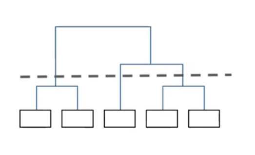

- 비계층적 군집 : 사전에 군집 수 k를 정한 후, 각 객체를 k개 중 하나의 군집에 배정

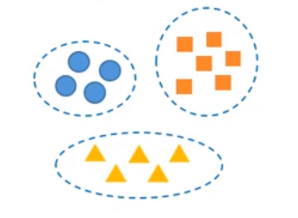

#### 4) 활용 분야 

: 마케팅의 시장세분화에 많이 사용

- 카드사에서 VIP 고객들을 군집화해 일반 고객군과 어떤 차이점이 있는지 파악할 때

- 프렌차이즈 사업이나 여러 매장을 직영하는 경우, 전체 매장 또는 가맹점 가운데 유사한 성향을 보이는 매장끼리 군집화해 차별화된 관리 가능

## II. 유사성 척도

개체 간의 유사성 정도를 정량적으로 나타내기 위해서는 척도가 필요하다.

- 거리 척도 : 거리가 가까울수록 유사성이 크다. 거리가 멀수록 유사성이 적어짐

- 상관계수척도 : 객체간 상관계수가 클수록 두 객체의 유사성이 커짐 (변수간이 아닌 객체간!)

### 1. 거리척도

객체 i의 p차원 공간에서의 좌표는 다음과 같은 열벡터로 표현한다.

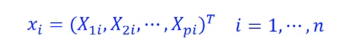

#### 1) 유클리디안 거리

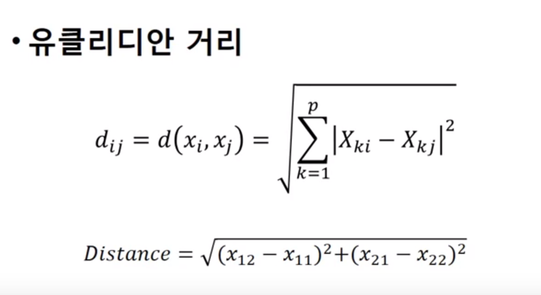

- 문제점
  - 큰 값에 영향을 받음 : 표준화 시킴
    - 원시 척도는 각 변수의 단위 크기(scale)에 영향을 받기 때문에, 값이 큰 변수(예: 매출액)는 총 거리에 매우 큰 영향을 줌
    - 유클리드 거리를 구하기 전에 정규화(또는 표준화, Z-score) 필요

  - 측정 항목 사이의 상관관계가 무시됨 => 통계적 거리 사용
  - 극단치에 민감 => 맨하탄 거리 사용

#### 2) 민코프스키 거리 

: 유클리디안 거리의 일반화된 방법(m=2일 때는 유클리디안 거리와 동일)

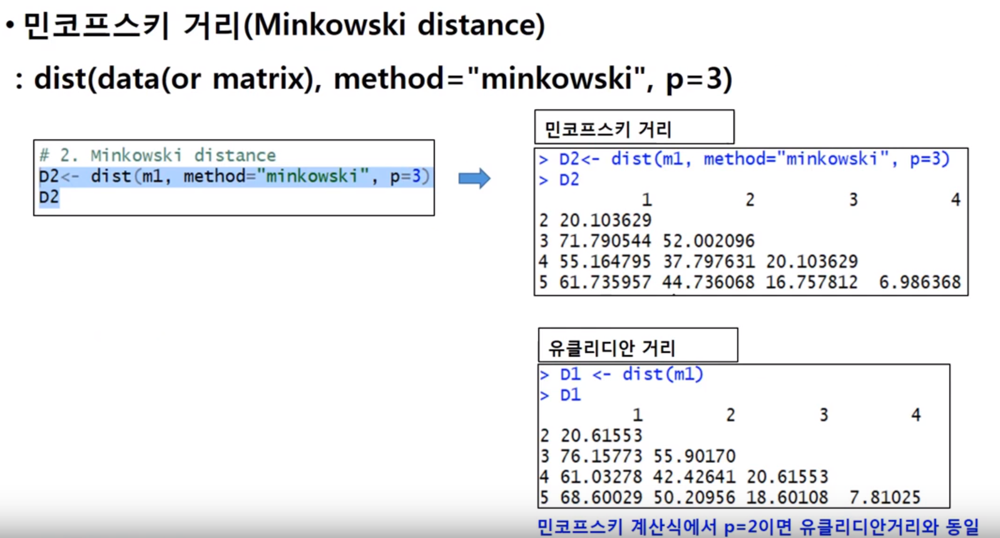

#### 3) 마할라노비스 거리 

: 변수 간의 상관 관계가 존재할 때 사용

### 2. 상관계수 척도

: 상관계수를 척도로 사용. 상관계수가 클수록 두 객체의 유사성이 크다고 추정

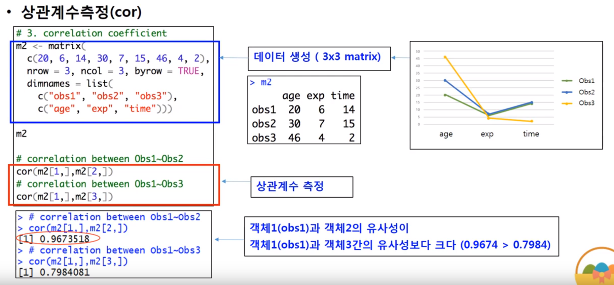

## III. 계층적 군집화

예제) 효과적인 타겟 마케팅을 하기 위해 마켓 세그먼트를 한다.

관련변수 : Income, Brand Loyalty

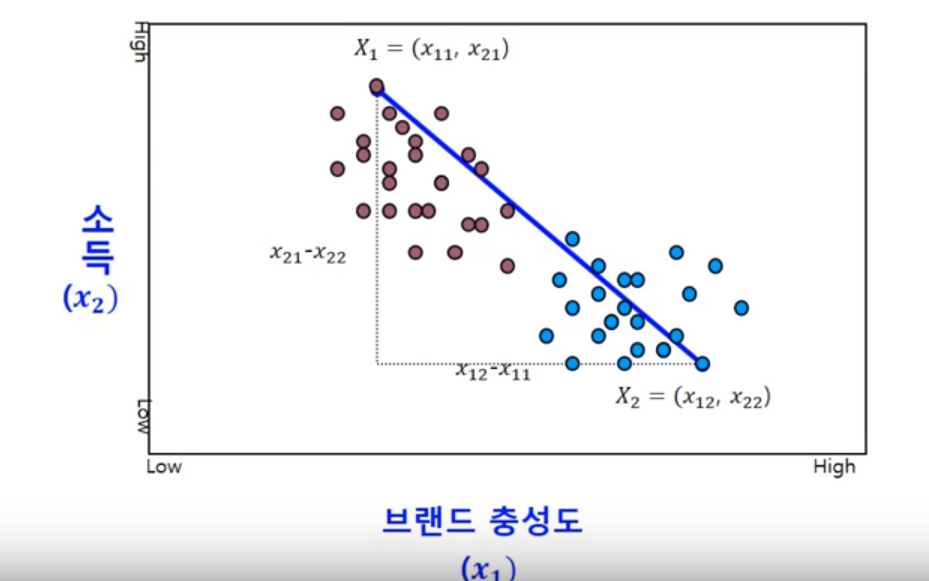

브랜드 충성도와 소득을 기준으로 군집을 나눈다고 할 때!

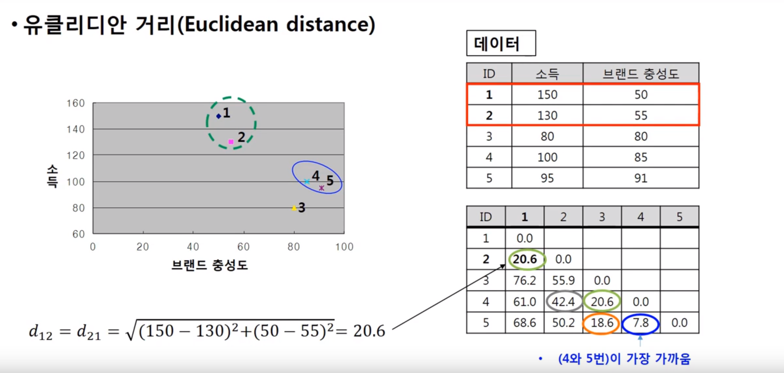

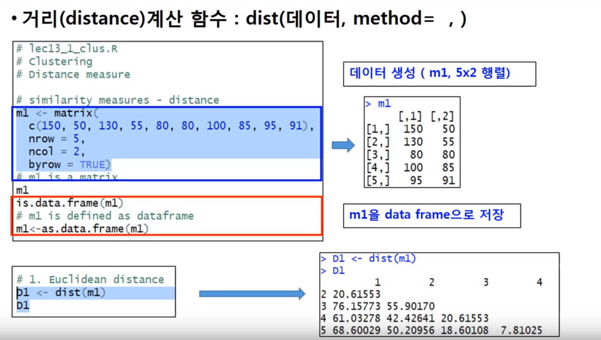

이렇게 거리가 구해지고 나면, 가까운 그룹들끼리 묶어줘야 한다. 그럴 때 묶어주는 방법은 다음과 같다.

- 병합(agglomerative) : n개의 군집들을 갖고 시작해서 최종적으로 하나의 군집이 남을 때까지 순차적으로 유사한 군집들을 병합 (즉, 가까운 것들끼리 순차적으로 묶어주는 것)

- 분할(divisive) : 병합과 반대 방향으로 작용하는데, 모든 행들을 포함하고 있는 하나의 군집에서 출발해 n개의 군집으로 분할. 즉, 먼 객체들끼리 순차적으로 나눠 가는 방법
- 병합과 분할을 하는 데에 있어서 Single Linkage Method(단일연결법), Complete Linkage Method(완전연결법), Centroid Method(평균연결법) 3가지의 방법이 사용된다.

### 1. 단일연결법 

: 가장 가까운 것들끼리 묶어주는 방법

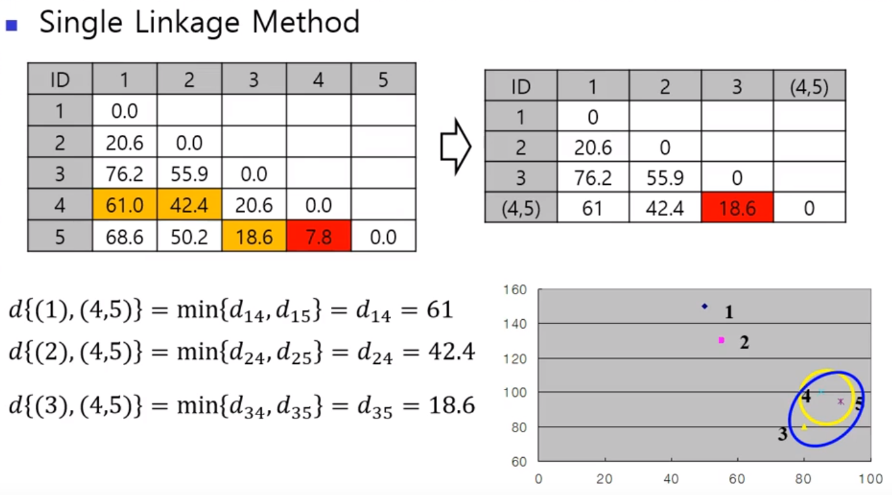

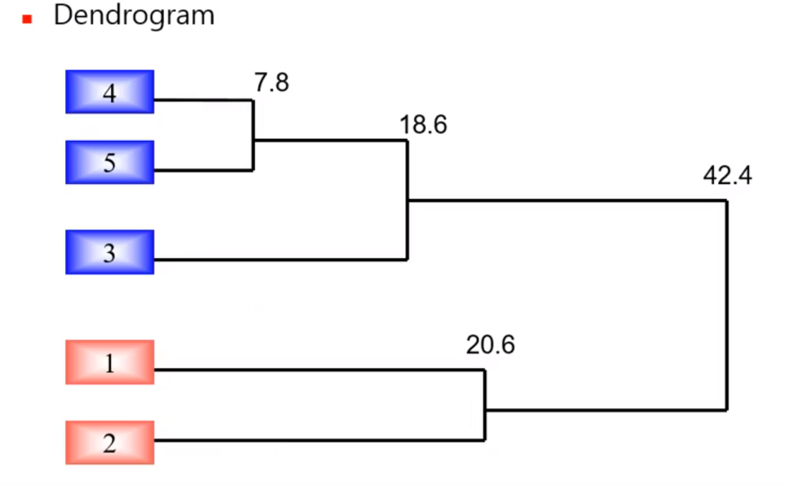

### 2. 완전연결법

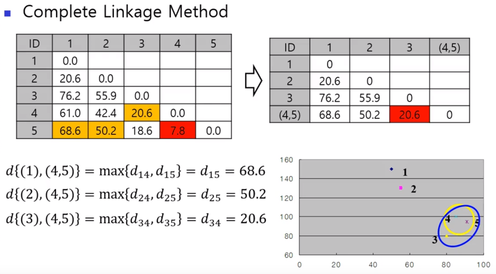

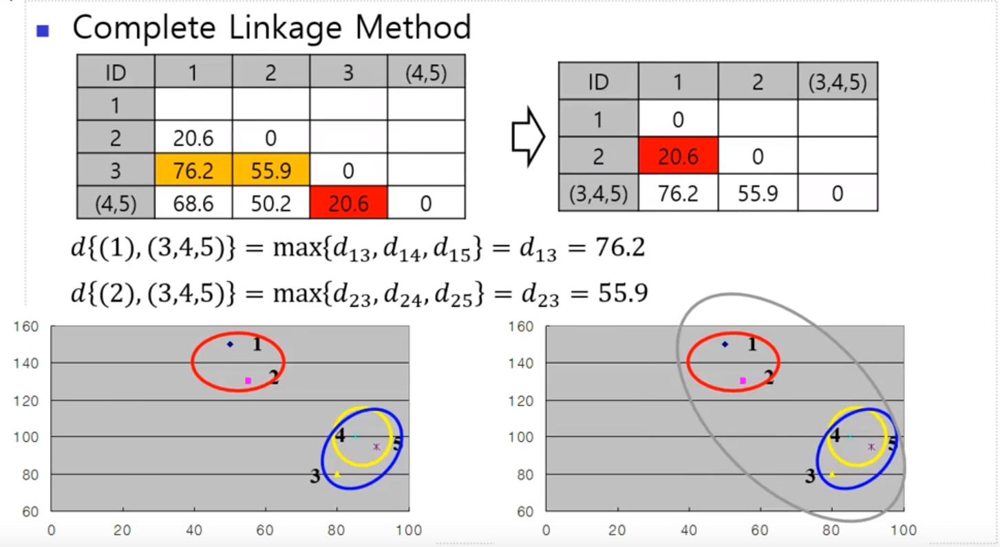

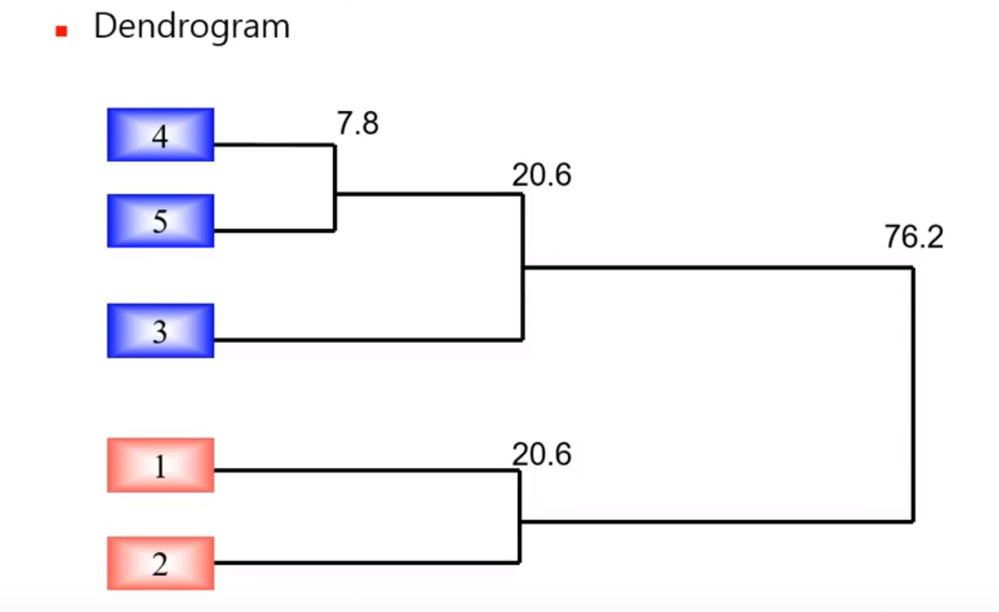

(Centroid는 위 과정을 평균값으로!)

### 3. 계층적 군집화의 장단점

#### 1) 장점

- 군집의 수를 명시할 필요가 없음

- 판별이 순전히 데이터에 따라 처리됨

- 덴드로그램을 통해 군집화 프로세스와 결과물을 표현하므로 이해 및 설명이 더 수월

#### 2) 단점

- 계층적 군집화는 n*n 거리 행렬을 계산하고 저장하므로 데이터 집합이 매우 클 경우에 계산 속도가 느려진다.

- Single Linkage와 Complete Linkage가 Centroid Method에 비해 거리척도(예: 유클리드, 통계적 거리)의 변동에 대해서 덜 민감하다

- 계층적 군집화는 이상치에 민감

-----

## IV. 비계층적 군집화

### 1. k-means 알고리즘

- 계층적이게 군집을 형성시키지 않고 개체들을 몇 개의 군집으로 구분

- 군집의 수를 사전에 정의하고 군집들 내부의 분산을 최소화 하도록 각각의 케이스를 k개의 군집들 중 하나에 할당

- 초기에 부적절한 병합(혹은 분리)이 일어났을 때 회복 가능

- 개체의 수가 많을 때 유용

### 2. k-means 과정

1) 군집수 k 결정, 최초 군집기준값 결정(랜덤)

2) 군집분류, 군집기준값 설정 : 각 레코드는 "가장 가까운" 중심을 가진 군집에 할당

3) 군집재분류, 군집기준값 변경

군집들 사이에 더 이상 관찰치를 이동하는 것이 군집의 분산을 증가시키지 않는다면, 군집화 멈춤

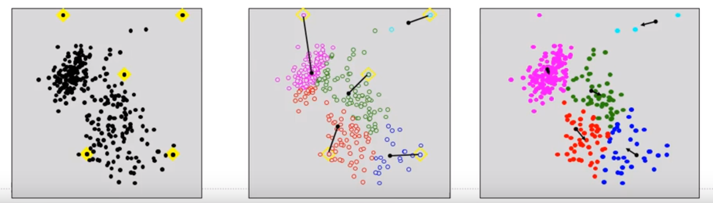

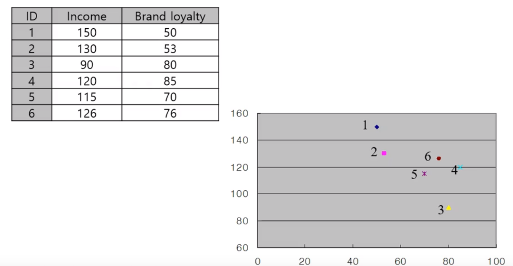

기준을 1,3으로 정했을 때

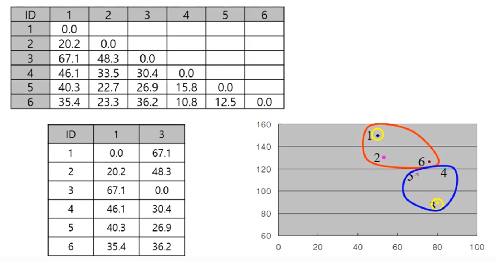

1, 3을 기준으로 거리를 쫙 계산해서 최소 거리를 기준으로 묶어 줌.

이렇게 묶었을 때 각 군집의 총 거리 합을 기준으로 새로운 기준값을 제시 함.

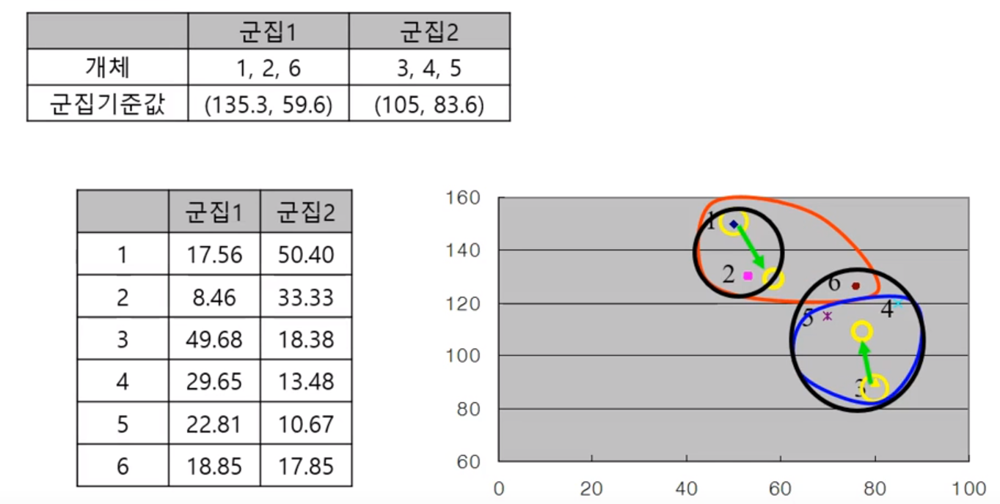

### 3. k-means 군집화 이슈

#### 1) Cluster 관련

- 가장 적정한 수(k를 몇으로 할지)를 어떻게 결정할 것인가?

- 1개의 instance는 꼭 1개의 Cluster에만 포함돼야 하는가?

- Bias 없는 초기 Seeds 선정 방법은?

#### 2) Distance Function 관련 이슈

- 어떤 distance function을 사용할 것인가? (data type, dimension 등 고려)

- Cluster간 거리의 기준을 어떻게 볼 것인가?

#### 3) Data handling

- Data normalization

- Data Discretization

#### 4) Outlier 처리

- Outlier를 어떻게 detecting할 것인가?

- Detecting된 Outlier를 어떻게 처리할 것인가?

----

## V. 나가기

### 1. 군집분석의 유용성 검증

#### 1) 군집의 해석

- 군집분석 결과에 대한 해석이 논리적으로 맞는가?

- 군집분석에 사용된 각 변수들에 대해 각 군집의 요약통계량(예: 평균, 최소값, 최대값) 구하기 

- 해석 내용을 기반으로 각 군집에 대해 이름이나 라벨 붙이기

#### 2) 군집의 안정성

- 만약 일부 입력값들이 약간 달라지면 나누어진 군집들이 유의하게 변화하는가?

- 데이터를 나누어 한 부분을 기반으로 다른 부분에 적용해 군집들이 잘 형성되는지 검증

#### 3) 군집의 분리

- 군집 간 및 군집 내 변동률을 조사

- ANOVA분석 및 (F-value, an F-ratio) 통계적 검정법 사용

### 2. 군집분석의 장단점

#### 1) 장점

- 사전에 그룹분류에 대한 정보가 없는 데이터를 가지고 사용자가 추구하는 바에 맞게 그룹을 나눌 수 있음

- 차별적인 속성을 바탕으로 몇 가지 패턴으로 구분되는지 파악하기 위해서는 군집분석이 효과적으로 활용될 수 있음

#### 2) 한계

- k-means 군집분석 기법의 경우 사용자가 사전 지식 없이 그룹의 수를 정해주는 일이 많기 때문에 결과가 잘 나오지 않거나, 분석 결과에 대한 해석이 어려워질 수 있음

- 군집분석은 다른 데이터마이닝 기법이나 다른 통계적 분석기법과 병행해 사용되는 경우가 많음
  - 예) 군집분석을 통한 그룹결정 => 의사결정나무분석을 통한 중요 규칙 발견

cf) Self-Organizing Feature Map (SOM)

