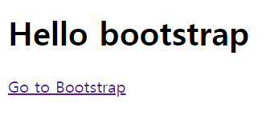

# 191107

## I. HTML & CSS

Viewport 단위

디바이스마다 다른 크기의 화면을 가지고 있기 때문에 상대적인 단위인 viewport를 기준으로 만든 단위

RGBA : 투명도까지 설정 가능!


```css
margin-1 {
    margin : 0px; // 상하좌우 0
}

margin-2 {
    margin : 0px 20px; // 상하 0, 좌우 20
}

margin-3 {
    margin : 0px 20px 20px; // 상0 좌우 20 하 20?
}
```


inline : 새로운 라인에서 시작하지 않으며 문장의 중간에 들어갈 수 있다. content의 너비만큼 너비를 차지한다.

inline에서는 상하좌우 속성을 설정할 수 없는데 inline-block에서는 설정 가능


visible : hidden 은 공간을 차지하지만 display : none은 공간조차 차지하지 않는다.

position : relative => 부모를 기준으로 상대적으로 적용됨

position : absolute => 자신이 속한 부모를 기준으로 상대적으로 적용

position : fixed => 부모 요소와 관계없이 브라우저의 좌표 프로퍼티를 이용. 스크롤이 돼도 화면에서 사라지지 않음


bootstrap 사용법

https://getbootstrap.com/docs/4.3/getting-started/introduction/

```HTML
<link rel="stylesheet" 		href="https://stackpath.bootstrapcdn.com/bootstrap/4.3.1/css/bootstrap.min.css" integrity="sha384-ggOyR0iXCbMQv3Xipma34MD+dH/1fQ784/j6cY/iJTQUOhcWr7x9JvoRxT2MZw1T" crossorigin="anonymous">


<script src="https://code.jquery.com/jquery-3.3.1.slim.min.js" integrity="sha384-q8i/X+965DzO0rT7abK41JStQIAqVgRVzpbzo5smXKp4YfRvH+8abtTE1Pi6jizo" crossorigin="anonymous"></script>
<script src="https://cdnjs.cloudflare.com/ajax/libs/popper.js/1.14.7/umd/popper.min.js" integrity="sha384-UO2eT0CpHqdSJQ6hJty5KVphtPhzWj9WO1clHTMGa3JDZwrnQq4sF86dIHNDz0W1" crossorigin="anonymous"></script>
<script src="https://stackpath.bootstrapcdn.com/bootstrap/4.3.1/js/bootstrap.min.js" integrity="sha384-JjSmVgyd0p3pXB1rRibZUAYoIIy6OrQ6VrjIEaFf/nJGzIxFDsf4x0xIM+B07jRM" crossorigin="anonymous"></script>
```


style link를 head 닫는 부분 바로 위에, script 태그 3개를 body태그 닫는 부분 바로 위에 넣는다.




animate.css 에서 View on Github 들어가서 다양한 애니메이션 태그 사용할 수 있다.

```HTML
<link rel="stylesheet" href="https://cdnjs.cloudflare.com/ajax/libs/animate.css/3.7.2/animate.min.css">
<!-- 이 링크 걸어주면 됨 -->
```


----

## II. 파이썬

https://wikidocs.net/book/1 파이썬 기초 공부하기 좋음

파이썬 3.6 버전부터는 f 문자열 포매팅 기능을 사용할 수 있다. 파이썬 3.6 미만 버전에서는 사용할 수 없는 기능이므로 주의해야 한다.

다음과 같이 문자열 앞에 f 접두사를 붙이면 f 문자열 포매팅 기능을 사용할 수 있다.

```python
>>> name = '홍길동'
>>> age = 30
>>> f'나의 이름은 {name}입니다. 나이는 {age}입니다.'
'나의 이름은 홍길동입니다. 나이는 30입니다.'
```


튜플은 리스트와 비슷한 형태이나 값을 고정시키고 싶을 때 사용한다.

딕셔너리 : 자바의 해쉬맵이 모여있는 느낌

파이썬은 자바와 다르게 들여쓰기를 잘 해야함. 들여쓰기는 앵간하면 탭보다는 공백으로 하자! 


venv\

```bash
# 가상환경 설치
$ pip install virtualenv

# 가상환경 생성
$ virtualenv venv


# 가상환경 실행
$ source venv/Scripts/activate
(venv) 

# 플라스크 설치
$ pip install flask

# 플라스크 실행
$ env FLASK_APP=hello.py flask run
 * Serving Flask app "hello.py"
 * Environment: production
   WARNING: This is a development server. Do not use it in a production deployment.
   Use a production WSGI server instead.
 * Debug mode: off
 * Running on http://127.0.0.1:5000/ (Press CTRL+C to quit)
```


```python
from flask import Flask, render_template
import random

app = Flask(__name__)

@app.route('/')
def hello():
    name = "World!!"
    return f'Hello {name}!'

@app.route('/mulcam')
def mulcam():
    return 'Hello mulcam'

@app.route('/greeting/<string:name>') # 어떤 이름으로 변수를 받을지
def greeting(name):
    return f'{name}님 안녕하세요.'

# 인원수만큼 점심메뉴 추천해주는 기능 만들기~
@app.route('/lunch/<int:num>')
def lunch(num):
    menu=["짜장면", "짬뽕", "라면", "스테이크", "삼겹살", "초밥"]
    order = random.sample(menu, num)
    return str(order)

# 실습 : /lotto를 입력 받으면 6개의 수 추천
@app.route('/lotto')
def lotto():
    random_num = random.sample(range(1, 46), 6)
    return str(random_num)

@app.route('/html')
def html():
    multiline = '''
    <h1> This is h1 tag </h1>
    <p> This is p tag </p>
    <div style="background-color: red; width: 100px; height: 100px;"> </div>
    '''
    return multiline

@app.route('/hi/<string:name>')
def hi(name):
    return render_template('hi.html', name=name) #템플릿 파일을 로드할 때 이런식으로 사용.

if __name__ == "__main__":
    app.run(debug=True, port=8000)
```

​	

```bash
# import requests를 에러 없이 호출하려면 설치부터 해야함 
$ pip install requests
```


```python
from flask import Flask, render_template, request
import random
import requests
from pprint import pprint


app = Flask(__name__)

@app.route('/')
def hello():
    name = "World!!"
    return f'Hello {name}!'

@app.route('/mulcam')
def mulcam():
    return 'Hello mulcam'

@app.route('/greeting/<string:name>') # 어떤 이름으로 변수를 받을지
def greeting(name):
    return f'{name}님 안녕하세요.'

# 인원수만큼 점심메뉴 추천해주는 기능 만들기~
@app.route('/lunch/<int:num>')
def lunch(num):
    menu=["짜장면", "짬뽕", "라면", "스테이크", "삼겹살", "초밥"]
    order = random.sample(menu, num)
    return render_template('menu.html', menu=order)

# 실습 : /lotto를 입력 받으면 6개의 수 추천
@app.route('/lotto')
def lotto():
    random_num = random.sample(range(1, 46), 6)
    return str(random_num)

@app.route('/html')
def html():
    multiline = '''
    <h1> This is h1 tag </h1>
    <p> This is p tag </p>
    <div style="background-color: red; width: 100px; height: 100px;"> </div>
    '''
    return multiline

@app.route('/hi/<string:name>')
def hi(name):
    return render_template('hi.html', name=name) #템플릿 파일을 로드할 때 이런식으로 사용.


@app.route('/fake_naver')
def fake_naver():
    return render_template('fake_naver.html')

# 구글로 검색창 만들기 실습
@app.route('/fake_google')
def fake_google():
    return render_template('fake_google.html')

@app.route('/send')
def send():
    return render_template('send.html')

@app.route('/receive')
def receive():
    name = request.args.get('name') # arguements 안에서 name이라는 이름을 가진 애를 받아오겠다
    message = request.args.get('message')
    return render_template('receive.html', name=name, msg=message)

# 인디언 이름짓기 시습
@app.route('/indian_send')
def indian_send():
    return render_template('indian_send.html')

@app.route('/indian_receive')
def indian_receive():
    name=request.args.get('name')
    name1=["말 많은", "시끄러운", "어두운", "적색", "조용한", "웅크린", "백색", "지혜로운", "용감한", "날카로운", "욕심많은"]
    name2=["늑대", "태양", "양", "매", "황소", "불꽃", "나무", "달빛", "말", "돼지", "하늘","바람"]
    name3=["와(과) 함께 춤을", "의 기상", "은(는) 그림자 속에", "의 환생", "의 죽음", "아래에서", "를(을) 보라", "이(가) 노래하다", "의 그림자",
    "의 일격", "에게 쫓기는 남자", "의 행진", "의 왕", "의 유령", "를(을) 죽인자"]

    random1 = random.choice(name1)
    random2 = random.choice(name2)
    random3 = random.choice(name3)
    
    random_name = random1+random2+random3

    return render_template('indian_receive.html', name=random_name)

@app.route('/lotto_get')
def lotto_get():
    return render_template('lotto_get.html')

@app.route('/lotto_num')
def lotto_num():
    num = request.args.get("num")
    url = f"https://dhlottery.co.kr/common.do?method=getLottoNumber&drwNo={num}"
    res = requests.get(url).json() # json형태로 변환
    
    # [받는변수 for 받는변수 in 범위데이터]
    wnum = [ res[f'drwtNo{i}'] for i in range(1, 7)]
    lotto = random.sample(range(1, 46), 6)

    match = list(set(wnum) & set(lotto))
    
    count = len(match)
    if count==6 :
        word = '축하합니다. 1등에 당첨되셨습니다!!'
    if count==5 :
        word = '축하합니다. 2등이십니다!!'
    if count==4 :
        word = '축하합니다. 3등이십니다~~'
    if count==3 :
        word = '축하해 4등이야^^'
    else :
        word = '넌 꽝이야^^'
    return render_template('lotto_result.html', num=num, wnum=wnum, lotto=lotto, word=word)


if __name__ == "__main__":
    app.run(debug=True, port=8000)
```

