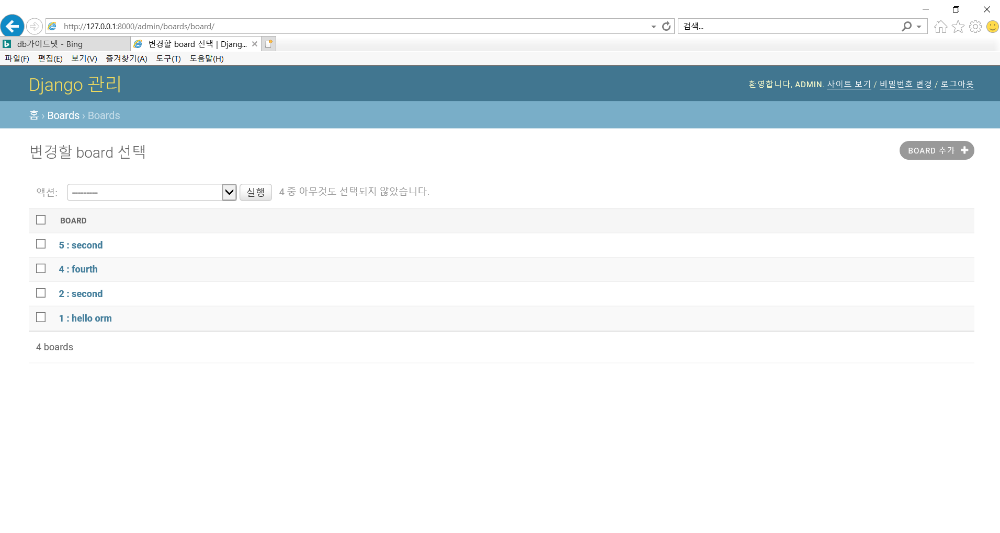
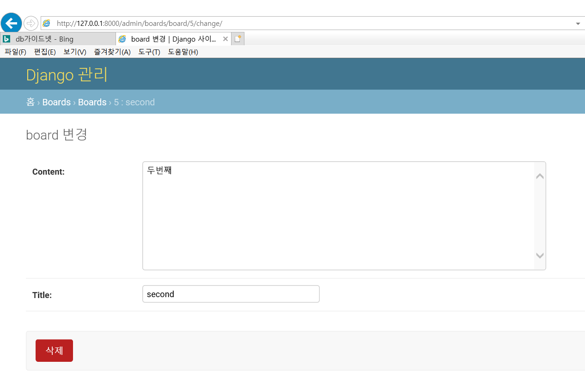
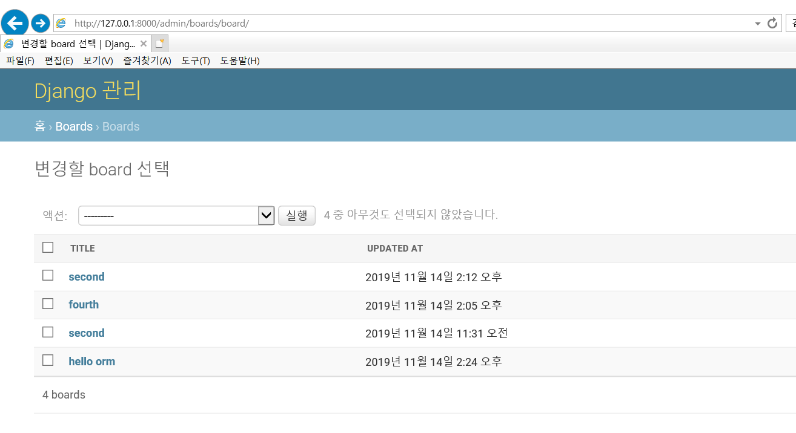
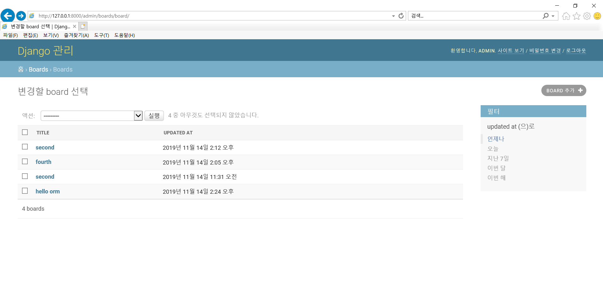
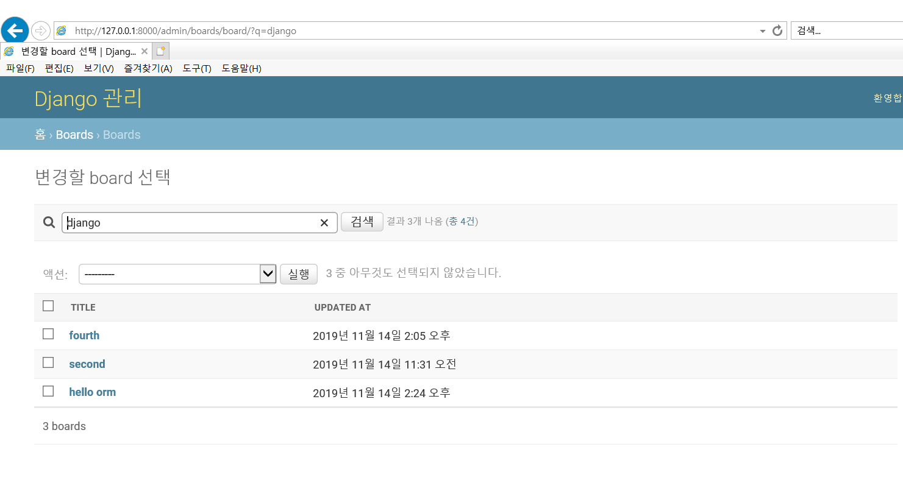

# 191114

## I. REVIEW

- project 생성

```bash
$ django-admin startproject config .
#django command not found라며 실행이 안될 경우 pip install django 
```


- settings.py

```python
LANGUAGE_CODE = 'ko-kr'

TIME_ZONE = 'Asia/Seoul'
```


- app 생성

```python
$ python manage.py startapp boards  # boards 부분이 앱 이름
```


- settings.py => INSTALLED_APPS 에서 만든 앱 추가 ('boards',)

```python
INSTALLED_APPS = [
    'boards',
    .
    .
]
```


- config > urls.py 

```python
urlpatterns = [
  path('board/', include('boards.urls')),
    .
    .
] 
# import path 뒤에 include추가 (from django.urls import path, include 다음과 같이!)
```


- boards에서 urls.py 생성

```python
from django.urls import path
from . import views # 현재 폴더에 있는 views를 import 하겠다.

urlpatterns = [
    path('', views.index) # views 안에 index가 없기 때문에 views.py에서 index 정의
]
```


- views.py

```python
from django.shortcuts import render

def index(request):
    return render(request, "boards/index.html") 
# index.html이 없으니까 boards 안에 templates 폴더 생성해서 boards폴더 생성해서 그 안에 index.html 생성하기
```


- boards > index.html

```html
<h1> Index Page </h1> <!-- 템플릿 확장을 하기 위해 config > settings.py에서 TEMPLATES에 DIRS를 설정해야 한다 -->
```


- settings.py

```python
TEMPLATES = [
    .
    .
    'DIRS' : [os.path.join(BASE_DIR, "config", "templates")] 
    # base 템플릿으로 사용할 html파일을 config 안에 templates 폴더를 생성한 뒤 그 안에 생성한다.
]
```


- config > templates > base.html

```html
<!-- bootstrap을 활용해 보자 -->
기본 form +
<head>
    
<link rel="stylesheet" href="https://stackpath.bootstrapcdn.com/bootstrap/4.3.1/css/bootstrap.min.css" integrity="sha384-ggOyR0iXCbMQv3Xipma34MD+dH/1fQ784/j6cY/iJTQUOhcWr7x9JvoRxT2MZw1T" crossorigin="anonymous">
</head>

<body>
     <!-- 상속한 html 파일에서 사용할 수 있도록 block 생성 -->
     <!-- block은 항상 endblock으로 닫아준다. -->
<script src="https://code.jquery.com/jquery-3.3.1.slim.min.js" integrity="sha384-q8i/X+965DzO0rT7abK41JStQIAqVgRVzpbzo5smXKp4YfRvH+8abtTE1Pi6jizo" crossorigin="anonymous"></script>
<script src="https://cdnjs.cloudflare.com/ajax/libs/popper.js/1.14.7/umd/popper.min.js" integrity="sha384-UO2eT0CpHqdSJQ6hJty5KVphtPhzWj9WO1clHTMGa3JDZwrnQq4sF86dIHNDz0W1" crossorigin="anonymous"></script>
<script src="https://stackpath.bootstrapcdn.com/bootstrap/4.3.1/js/bootstrap.min.js" integrity="sha384-JjSmVgyd0p3pXB1rRibZUAYoIIy6OrQ6VrjIEaFf/nJGzIxFDsf4x0xIM+B07jRM" crossorigin="anonymous"></script>
</body>
```


- boards > index.html

```html
 <!-- bootstrap을 담은 base.html을 상속하기 위해 작성 -->


<h1> Index Page </h1>

```


- 서버 실행 

```bash
$ python manage.py runserver
```


★bootstrap 적용을 확인하기 위해 네비게이션 바를 넣어보자.

- Bootstrap.com > Components > Navbar에서 마음에 드는 소스코드 고른 후 base.html의 body 상단부에 추가

- base.html

```html
<body>
    <!-- 상단부에 navbar 추가 -->
    <nav class="navbar navbar-expand-lg navbar-light bg-light">
      <a class="navbar-brand" href="#">Django</a>
      <button class="navbar-toggler" type="button" data-toggle="collapse" data-target="#navbarSupportedContent" aria-controls="navbarSupportedContent" aria-expanded="false" aria-label="Toggle navigation">
        <span class="navbar-toggler-icon"></span>
      </button>

      <div class="collapse navbar-collapse" id="navbarSupportedContent">
        <ul class="navbar-nav mr-auto">
          <li class="nav-item active">
            <a class="nav-link" href="#">Home <span class="sr-only">(current)</span></a>
          </li>
          <li class="nav-item">
            <a class="nav-link" href="#">Link</a>
          </li>
          <li class="nav-item dropdown">
            <a class="nav-link dropdown-toggle" href="#" id="navbarDropdown" role="button" data-toggle="dropdown" aria-haspopup="true" aria-expanded="false">
              Dropdown
            </a>
            <div class="dropdown-menu" aria-labelledby="navbarDropdown">
              <a class="dropdown-item" href="#">Action</a>
              <a class="dropdown-item" href="#">Another action</a>
              <div class="dropdown-divider"></div>
              <a class="dropdown-item" href="#">Something else here</a>
            </div>
          </li>
          <li class="nav-item">
            <a class="nav-link disabled" href="#" tabindex="-1" aria-disabled="true">Disabled</a>
          </li>
        </ul>
        <form class="form-inline my-2 my-lg-0">
          <input class="form-control mr-sm-2" type="search" placeholder="Search" aria-label="Search">
          <button class="btn btn-outline-success my-2 my-sm-0" type="submit">Search</button>
        </form>
      </div>
    </nav>
</body>
```


- MTV (MVC)

> 모델(모델)	/	템플릿(뷰)	/	뷰(컨트롤러)


----

## II. ORM

### 1. ORM 관련 용어 정리

- 쿼리란? 데이터베이스에 정보를 요청하는 명령어
- db : 체계화된 데이터의 모임

- 스키마란? DB자료의 구조, 표현방법, 관계 등을 정의한 구조
- 테이블
  - 필드 : 컬럼
  - 레코드 : 데이터 

장고는 내장 ORM이 있음!


### 2. ORM의 장/단점

#### 1) 장점

- SQL을 몰라도 DB에 접근해서 사용 가능
- SQL 구문이 아니기 때문에 코드의 가독성이 좋아진다. (파이썬 class의 instance를 생성하는 방식으로 작성하기 때문에!)
- SQL은 절차지향적이지만 ORM을 사용하면 객체지향적이어서 생산성이 좋아진다!
- 매핑 정보가 확실해서 ERD를 보는 것에 대한 의존도를 낮출 수 있다.


#### 2) 단점

blah blah


### 3. 실습

- python shell 실행

```bash
$ python manage.py shell
```

```shell
>>> class Person:
...     name = "사람의 고유한 이름"
...     age = "출생 이후로 부터 삶을 마감할 때까지의 기간"
...     def greeting(self): # Person의 메소드
...             print(f'{self.name}이 인사합니다.') 
...     def eating(self):
...             print(f'{self.name}이 밥을 먹고 있습니다.')
...     def aging(self):
...             print(f'{self.name}은 현재 {self.age}살이지만 점점 나이를 더 먹겠죠?^_^') 
... 
>>> justin = Person() # Person 인스턴스를 justin에 저장
>>> print(justin.name)
사람의 고유한 이름
>>> justin.age = 19
>>> print(justin.age)
19  
>>> justin.name = 'Justin'
>>> justin.greeting()
Justin이 인사합니다.
>>> justin.eating()
Justin이 밥을 먹고 있습니다.
>>> justin.aging()
Justin은 현재 19살이지만 점점 나이를 더 먹겠죠?^_^
>>> exit() # shell 종료
```


장고의 모델은 단일 데이터에 대한 정보를 가지고 있으며 필수적인 필드(컬럼)와 데이터(레코드)에 대한 정보를 포함한다. 

각각의 모델은 각 DB 테이블과 매핑이 된다. 

사용자가 저장하는 데이터의 필수적인 필드(컬럼)와 동작을 포함한다.


- model.py

```python
from django.db import models

# Create your models here.
class Board(models.Model): # models의 Model을 상속 받아서 만든다.
    title = models.CharField(max_length=10) # 캐릭터 필드는 max_length로 최대 길이를 설정해줘야 한다.
    content = models.TextField() # 텍스트 필드에도 max_length를 줄 수 있는데 DB에 적용이 되는 것이 아니고 외부에서 글자 제한으로 보여질 뿐임!
    created_at = models.DateTimeField(auto_now_add=True) # 날짜 데이터는 데이트 타임 필드로! auto_now_add는 해당 데이터가 DB에 저장이 될 때 저장이 되는 시간을 created_at에 자동으로 넣어주는 기능
    # 장고에서는 pk로 쓰는 id가 자동으로 생성이 된다. 따라서 우리는 컬럼명에 주로 신경쓰면 된다!
```


- models.py안의 내용을 기반으로 migration 수행 (모델 내용을 원하는 위치에 저장하겠다는 것)

```bash
$ python manage.py makemigrations
Migrations for 'boards':
  boards\migrations\0001_initial.py # 해당 위치에 해당 파일 생성됨
    - Create model Board
```


- 0001_initial.py 생긴거만 보자

```python
# Generated by Django 2.2.7 on 2019-11-14 01:47

from django.db import migrations, models


class Migration(migrations.Migration):

    initial = True

    dependencies = [
    ]

    operations = [
        migrations.CreateModel(
            name='Board',
            fields=[
                ('id', models.AutoField(auto_created=True, primary_key=True, serialize=False, verbose_name='ID')), # id 자동으로 생성된 것 확인할 수 있다.
                ('title', models.CharField(max_length=10)),
                ('content', models.TextField()),
                ('created_at', models.DateTimeField(auto_now_add=True)),
            ],
        ),
    ]
    
# DB에 테이블을 만들 준비가 끝난 것! 적용을 시킨 건 아니고 만들 준비까지만 끝난 단계!
```


- models.py에 updated_at 추가

```python
updated_at = models.DateTimeField(auto_now=True) # 데이터 수정 시간에 대한 컬럼 추가. 데이터 수정 시점에 맞춰서 자동으로 데이터를 업데이트 하기 위해 auto_now=True 옵션을 추가한다.
```


- 다시 명세서 추가하기 위해 migrations 추가

```bash
$ python manage.py makemigrations
Migrations for 'boards':
  boards\migrations\0002_board_updated_at.py
```


- migration 파일의 sql 쿼리 확인하는 법

```bash
$ python manage.py sqlmigrate boards 0001
# python manage.py sqlmigrate 앱이름 migrate파일의숫자
BEGIN;
--
-- Create model Board
--
CREATE TABLE "boards_board" ("id" integer NOT NULL PRIMARY KEY AUTOINCREMENT, "title" varchar(10) NOT NULL, "content" text NOT NULL, "created_at" datetime NOT NULL);
COMMIT; # NOT NULL옵션이 자동으로 추가된 것도 확인할 수 있다!
```


- migration이 적용이 되었는지 확인하는 법

```bash
$ python manage.py showmigrations
admin
 [X] 0001_initial
 [X] 0002_logentry_remove_auto_add
 [X] 0003_logentry_add_action_flag_choices
auth
 [X] 0001_initial
 [X] 0002_alter_permission_name_max_length
 [X] 0003_alter_user_email_max_length
 [X] 0004_alter_user_username_opts
 [X] 0005_alter_user_last_login_null
 [X] 0006_require_contenttypes_0002
 [X] 0007_alter_validators_add_error_messages
 [X] 0008_alter_user_username_max_length
 [X] 0009_alter_user_last_name_max_length
 [X] 0010_alter_group_name_max_length
 [X] 0011_update_proxy_permissions
boards
 [ ] 0001_initial
 [ ] 0002_board_updated_at
contenttypes
 [X] 0001_initial
 [X] 0002_remove_content_type_name
sessions
 [X] 0001_initial
 
# 대괄호 안에 X쳐져 있으면 적용이 돼 있는 것
```


- 비어있는 2개를 적용하기 위해 다음과 같이 실행하고 확인해 본다.

```bash
$ python manage.py migrate

$ python manage.py showmigrations
admin
 [X] 0001_initial
 [X] 0002_logentry_remove_auto_add
 [X] 0003_logentry_add_action_flag_choices
auth
 [X] 0001_initial
 [X] 0002_alter_permission_name_max_length
 [X] 0003_alter_user_email_max_length
 [X] 0004_alter_user_username_opts
 [X] 0005_alter_user_last_login_null
 [X] 0006_require_contenttypes_0002
 [X] 0007_alter_validators_add_error_messages
 [X] 0008_alter_user_username_max_length
 [X] 0009_alter_user_last_name_max_length
 [X] 0010_alter_group_name_max_length
 [X] 0011_update_proxy_permissions
boards
 [X] 0001_initial
 [X] 0002_board_updated_at
contenttypes
 [X] 0001_initial
 [X] 0002_remove_content_type_name
sessions
 [X] 0001_initial
 
# 모두 적용된 것을 확인할 수 있다.
```


- 변경순서
  - models.py를 작성
  - makemigrations : migration 파일(명세서) 생성
  - migrate : 실제 적용되는 부분


- db.sqlite3를 그냥 열면 글자가 깨져서 나오기 때문에 이를 해결하기 위해서는?
  - https://www.sqlite.org/download.html > Precompiled Binaries for Windows > sqlite-dll-win64-x64-3300100.zip과 sqlite-tools-win32-x86-3300100.zip을 다운로드 후 압축을 푼다.
  - tool 폴더를 C드라이브에 sqlite라는 이름으로 저장한다. 
  - dll 폴더의 sqlite3.dll 파일을 C > sqlite 에 저장한다.

  - bashrc파일을 생성해서 다음과 같이 수정한다.

  ```bash
  $ vim ~/.bashrc
  
  alias sqlite="C:/sqlite/sqlite3.exe" 
  # alias는 별명을 붙여주는 것으로 sqlite의 경로를 다음과 같이 쉬운 이름으로 저장해 놓는 것
  ```

  - sqlite로 실행이 되는지 확인

  ```bash
  $ sqlite
  SQLite version 3.30.1 2019-10-10 20:19:45
  Enter ".help" for usage hints.
  Connected to a transient in-memory database.
  Use ".open FILENAME" to reopen on a persistent database.
  sqlite> .exit # 종료
  ```

  - db.sqlite3을 실행

  ```bash
  $ sqlite db.sqlite3
  SQLite version 3.30.1 2019-10-10 20:19:45
  Enter ".help" for usage hints.
  sqlite> .tables # 테이블 확인
  auth_group                  boards_board
  auth_group_permissions      django_admin_log
  auth_permission             django_content_type
  auth_user                   django_migrations
  auth_user_groups            django_session
  auth_user_user_permissions
  
  sqlite> .schema boards_board # sql 구문 확인
  CREATE TABLE IF NOT EXISTS "boards_board" ("id" integer NOT NULL PRIMARY KEY AUTOINCREMENT, "title" varchar(10) NOT NULL, "content" text NOT NULL, "created_at" datetime NOT NULL, "updated_at" datetime NOT NULL);
  ```

  

- 셸을 들어가서 실습해보자.

```bash
$ python manage.py shell
# 모델에 설정한 객체를 사용하기 위해서는 import를 해야한다.
>>> from boards.models import Board # 선언한 이름에 맞춰서 Board라는 이름으로 import

# objects : db관련 매니지 역할을 하는 인터페이스
>>> Board.objects.all() # select * from Board와 같은 의미!            
<QuerySet []> # DB에 데이터가 없어서 이렇게 나오는 것

# DB에 데이터 넣기
# ----------------------------------1번째 생성 방법-------------------------------------
>>> board = Board() # 인스턴스 생성
>>> board.title = "first"
>>> board.content = "django !!!!" 
>>> board       
<Board: Board object (None)>
>>> board.save() # 객체를 저장
>>> board
<Board: Board object (1)> # None이었던 객체가 1로 된 것을 확인할 수 있다.
# ----------------------------------2번째 생성 방법-------------------------------------
>>> board = Board(title="second", content="django") # 인스턴스를 생성할 때 바로 title과 content를 설정해주기
>>> board.save()
>>> board
<Board: Board object (2)>
# ----------------------------------3번째 생성 방법-------------------------------------
>>> Board.objects.create(title="third", content="django") # 바로 생성해버리기~
<Board: Board object (3)>

# 생성한 데이터 확인해 보면?
>>> Board.objects.all()
<QuerySet [<Board: Board object (1)>, <Board: Board object (2)>, <Board: Board object (3)>]> # 리스트로 반환이 되는 것을 확인할 수 있다.

# object라는 이름으로 반환이 되면 어떤 데이터인지 확인하기 힘드므로 models.py를 수정한다.
```


- models.py에 다음과 같이 추가

```python
# query 결과로 리턴되는 object를 보기 쉽게 하기 위해 다음과 같이 메소드 수행
    def __str__(self): # double under bar = 던더ㅋㅋ
        return f'{self.id} : {self.title}'
    # 테이블이 변경된 것이 아니고 메소드만 추가한 것이므로 migration을 따로 적용하지 않아도 괜찮음. but, 커맨드는 다시 실행해야 한다!
```


- 커맨드 재실행 후 변경사항 확인

```bash
# 가상환경 구축이 선행됐는지 확인 먼저 하고! 선행됐으면 다음으로 넘어간다.

$ python manage.py shell # 셸 실행
>>> from boards.models import Board 
>>> Board.objects.all()
<QuerySet [<Board: 1 : first>, <Board: 2 : second>, <Board: 3 : third>]>
```


- 데이터 객체를 만드는 3가지 방법 다시 요약!

  - ```shell
    board = Board()
    board.title = "값"
    board.save()
    ```

  - ```shell
    board = Board(title="값", content="값")
    board.save()
    ```

  - ```shell
    board = Board.objects.create(title="값", content="값")
    ```


model.py에서 설정할 수 있는 field 정보는 https://docs.djangoproject.com/en/2.2/ref/models/fields/ 에서 확인할 수 있다.


### 4. 데이터에 접근하는 방법

```python
>>> board = Board()
>>> board.title = "fourth"
>>> board.content = "django"
>>> board.id
>>> board.created_at   
>>> board.save()
>>> board.id
4
>>> board.created_at
datetime.datetime(2019, 11, 14, 5, 5, 18, 856372, tzinfo=<UTC>)
>>> board2 = Board()
>>> board2.title = "12345678901"
>>> board2.full_clean() # full_clean()로 validation 체크를 할 수 있다.
Traceback (most recent call last):
  File "<console>", line 1, in <module>
  File "C:\Users\novem\OneDrive\바탕화~1\Mulcam\191114\venv\lib\site-packages\django\db\models\base.py", line 1203, in full_clean
    raise ValidationError(errors)
django.core.exceptions.ValidationError: {'title': ['이 값이 최대 10 개의 글자인지 확인하세요(입력값 11 자).'], 'content': ['이 필드는 빈 칸으로 둘 수 없습니다.']}
    
>>> b = Board.objects.all()
>>> b
<QuerySet [<Board: 1 : first>, <Board: 2 : second>, <Board: 3 : third>, <Board: 4 : fourth>]>

# index로 접근하기
>>> b[0] # 리스트로 리턴되기 때문에 index로 접근할 수가 있음!
<Board: 1 : first>
>>> b[1].title
'second'
>>> b[1:3] # 여러 개를 불러올 수도 있다.
<QuerySet [<Board: 2 : second>, <Board: 3 : third>]>
>>> type(b)
<class 'django.db.models.query.QuerySet'> # 여러 개가 넘어오면 쿼리셋 (리스트처럼 생각하면 됨)
>>> type(b[0])
<class 'boards.models.Board'> # 하나 하나는 인스턴스!

# pk로 접근하기
>>> b = Board.objects.get(pk=3)
>>> b
<Board: 3 : third>
        
# get(컬럼명='값')으로 접근하기 (하나의 데이터에 접근할 때에 사용)
>>> b = Board.objects.get(title='second')
>>> b
<Board: 2 : second>

# but, 해당 데이터가 두 개 이상일 경우에는 에러가 뜬다!
>>> Board.objects.create(title='second', content='두번째')
<Board: 5 : second>
>>> b = Board.objects.get(title='second')
Traceback (most recent call last):
  File "<console>", line 1, in <module>
  File "C:\Users\novem\OneDrive\바탕화~1\Mulcam\191114\venv\lib\site-packages\django\db\models\manager.py", line 82, in manager_method
    return getattr(self.get_queryset(), name)(*args, **kwargs)
  File "C:\Users\novem\OneDrive\바탕화~1\Mulcam\191114\venv\lib\site-packages\django\db\models\query.py", line 412, in get
    (self.model._meta.object_name, num)
boards.models.Board.MultipleObjectsReturned: get() returned more than one Board -- it returned 2!
    
# 여러 개의 데이터에 접근할 때에는 filter를 사용한다.
>>> b = Board.objects.filter(title='second')
>>> b
<QuerySet [<Board: 2 : second>, <Board: 5 : second>]>


# 해당 단어를 포함하는 데이터를 불러올 때에는 컬럼명__contains='단어'의 형식으로 불러올 수 있다.
>>> b = Board.objects.filter(title__contains='sec') 
>>> b
<QuerySet [<Board: 2 : second>, <Board: 5 : second>]>

# 해당 단어로 시작하는 데이터를 불러올 때에는 컬럼명__startswith='단어'의 형식으로!
>>> b = Board.objects.filter(title__startswith='fi') 
>>> b
<QuerySet [<Board: 1 : first>]> # 하나를 리턴해도 쿼리셋(=리스트)으로 가져온다는 것!

# 해당 단어로 끝나는 데이터를 불러올 때에는 컬럼명__endswith='단어'의 형식으로!
>>> b
<QuerySet [<Board: 2 : second>, <Board: 3 : third>, <Board: 5 : second>]>

# 데이터 업데이트 하기
>>> b = Board.objects.get(pk=1)
>>> type(b)
<class 'boards.models.Board'> # 인스턴스
>>> b.title = "hello orm"
>>> b.save() # 저장을 해줘야 바뀐 값이 반영됨
>>> b = Board.objects.get(pk=1)
>>> b
<Board: 1 : hello orm>
        
# 데이터 삭제하기
>>> b = Board.objects.get(pk=3)
>>> b
<Board: 3 : third>
>>> b.delete()
(1, {'boards.Board': 1})
>>> Board.objects.all()
<QuerySet [<Board: 1 : hello orm>, <Board: 2 : second>, <Board: 4 : fourth>, <Board: 5 : second>]>
```


### 5. Admin 활용

#### 1) 관리자 계정 생성

```python
# 비밀번호 관련 제약 사항은 config > settings.py의 AUTH_PASSWORD_VALIDATOR에서 확인
$ python manage.py createsuperuser
사용자 이름 (leave blank to use 'novem'): admin
이메일 주소: 
Password: 
Password (again):
비밀번호가 사용자 이름와 너무 유사합니다.
비밀번호가 너무 일상적인 단어입니다.
Bypass password validation and create user anyway? [y/N]: y
Superuser created successfully.
```


#### 2) 서버 구동해서 계정 로그인

```python
$ python manage.py runserver
http://127.0.0.1:8000/admin/
```


#### 3) admin.py 설정

```python
from django.contrib import admin
from .models import Board # 현재 폴더 안에 있는 models의 Board를 import

# Register your models here.

admin.site.register(Board)
```



다음과 같이 확인할 수 있다.


- admin.py

```python
from django.contrib import admin
from .models import Board # 현재 폴더 안에 있는 models의 Board를 import

# Register your models here.

class BoardAdmin(admin.ModelAdmin):
    fields = ['content', 'title'] # 필드 순서를 바꿔서 적용

admin.site.register(Board, BoardAdmin) # 저장을 할 때 뒤에 BoardAdmin을 추가해주면 페이지까지 적용이 된다.
```





- admin.py에 list_display 추가

```python
class BoardAdmin(admin.ModelAdmin):
    fields = ['content', 'title'] # 필드 순서를 바꿔서 적용
    list_display = ['title', 'updated_at'] # 보고 싶은 컬럼명을 적어주면 해당 컬럼명이 위에 나타나게 된다.

admin.site.register(Board, BoardAdmin) # 저장을 할 때 뒤에 BoardAdmin을 추가해주면 페이지까지 적용이 된다.
```




- admin.py에 필터링을 할 수 있는 사이드 메뉴 추가

```python
class BoardAdmin(admin.ModelAdmin):
    fields = ['content', 'title'] # 필드 순서를 바꿔서 적용
    list_display = ['title', 'updated_at'] # 보고 싶은 컬럼명을 적어주면 해당 컬럼명이 위에 나타나게 된다.
    list_filter = ['updated_at']

admin.site.register(Board, BoardAdmin) # 저장을 할 때 뒤에 BoardAdmin을 추가해주면 페이지까지 적용이 된다.
```



- admin.py에 검색해서 해당되는 데이터만 검색해 주는 search_field 추가

```python
class BoardAdmin(admin.ModelAdmin):
    fields = ['content', 'title'] # 필드 순서를 바꿔서 적용
    list_display = ['title', 'updated_at'] # 보고 싶은 컬럼명을 적어주면 해당 컬럼명이 위에 나타나게 된다.
    list_filter = ['updated_at']
    search_fields = ['title', 'content'] # 검색하고자 하는 컬럼명을 [] 안에 넣어주면 됨

admin.site.register(Board, BoardAdmin) # 저장을 할 때 뒤에 BoardAdmin을 추가해주면 페이지까지 적용이 된다.
```




### 6. SUBWAY 실습

- models.py에 다음과 같이 추가

```python
class Subway(models.Model):
    name = models.CharField(max_length=15)
    date = models.DateTimeField(auto_now_add=True)
    menu = models.CharField(max_length=30)
    size = models.CharField(max_length=5)
    bread = models.CharField(max_length=15)
    add = models.CharField(max_length=15)

    def __str__(self):
        return f'{self.name}님이 {self.date}에 주문하신 메뉴의 레시피는 다음과 같습니다. (menu : {self.menu}, size : {self.size}, bread : {self.bread}, add : {self.add})'
```


- bash에서 다음과 같이 실행

```bash
$ python manage.py makemigrations
$ python manage.py showmigrations
$ python manage.py migrate
```


- urls.py에 다음과 같이 추가

```python
from django.urls import path
from . import views # 현재 폴더에 있는 views를 import 하겠다.

urlpatterns = [
    path('', views.index), # views 안에 index가 없기 때문에 views.py에서 index 정의
    path('subway_order/', views.subway_order),
    path('reciept/', views.reciept),
    path('id_order/id=<int:id>', views.id_order),
]
```


- views.py에 다음과 같이 추가

```python
def subway_order(request):
    menu=['에그마요', '이탈리안 비엠티', '터키 베이컨 아보카도']
    size=['15cm','30cm']
    bread=['화이트', '하티', '파마산오레가노', '위트', '허니오트', '플랫']
    add=['토마토', '오이', '할라피뇨', '레드식초', '샤우젼아일랜드']
    context={
        'menu':menu,
        'size':size,
        'bread':bread,
        'add':add
    }
    return render(request, 'subway_order.html', context)

def reciept(request):
    name=request.POST.get('name')
    date=request.POST.get('date')
    menu=request.POST.get('menu')
    size=request.POST.get('size')
    bread=request.POST.get('bread')
    add=request.POST.get('add')
    
    subway_new = Subway.objects.create(name=name, date=date, menu=menu, size=size, bread=bread, add=add)
    subway_new.save()
    
    get = Subway.objects.all()

    context = {
        'orders' : get
    }

    return render(request, 'reciept.html', context)

def id_order(request, id):
    call_info = Subway.objects.get(id=id)
    context = {
        'order' : call_info
    }

    return render(request, 'id_order.html', context)
```

