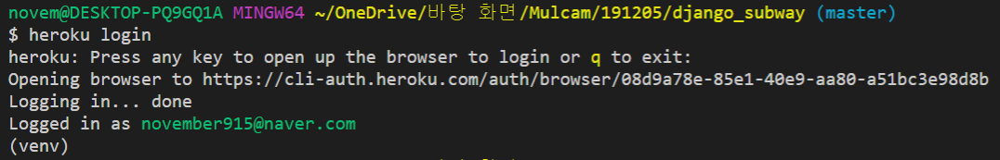
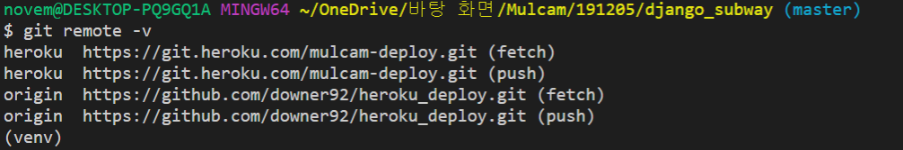

# 191205

## Heroku 배포

### 1. IaaS / PaaS

- IaaS ( Infrastructure as a Service )
  - AWS EC2
- PaaS (Platform as a Service)
  - Heroku, AWS EB


### 2. 배포 전 준비사항

1) github에 배포하려는 소스 올리기 (웬만하면 new repository로 깔끔하게)

2) decouple 설치

```bash
$ pip install python-decouple
```

3) .env 설정

config > settings.py에서 Secret key를 .env 파일에 넣어줄 것!

manage.py와 같은 루트에 .env 파일 생성

Secret key와 Debug=True를 .env파일에 잘라넣기 해준다. 

.env : = 앞 뒤로 띄어쓰기 없도록 유의!

```
SECRET_KEY=t!icfn90*#d(s3$zi&d7xtkj$zq^i(bz9y1duupd&aaql&!0ki
DEBUG=True
```

4) settings.py를 .env를 활용해 수정

settings.py를 다음과 같이 설정

```python
from decouple import config

# SECURITY WARNING: keep the secret key used in production secret!
SECRET_KEY = config('SECRET_KEY')

# SECURITY WARNING: don't run with debug turned on in production!
DEBUG = config('DEBUG')
```

==> 유출될 위험이 없어짐~

5) 헤로쿠 패키지 설치 및 임포트

헤로쿠 패키지 설치 : 장고를 헤로쿠에서 배포하기 위해 설치. 장고 앱이 헤로쿠에서 잘 동작할 수 있도록 자동적으로 환경을 갖춰줌

```bash
$ pip install django-heroku
```

settings.py 맨 하단부에 다음과 같이 추가

```python
import django_heroku
django_heroku.settings(locals())
```

여기까지가 사전 준비!


### 3. 배포를 위한 설정

1) Procfile 생성후 다음과 같이 작성

```
web: gunicorn config.wsgi --log-file -
```

2) gunicorn 설치 : 웹서버와 장고간의 데이터를 주고 받는 역할을 함 (wsgi대신 사용! heroku에서 추천)

```bash
$ pip install gunicorn
```

3) requirements.txt 파일 만들기

```bash
$ pip freeze > requirements.txt
```


### 4. 헤로쿠 설정

1) 헤로쿠 가입

2) heroku cli 다운로드

https://devcenter.heroku.com/articles/heroku-cli#download-and-install에서 heroku cli 다운로드

3) heroku login

```bash
$ heroku login
```



4) 앱 생성

```bash
$ heroku create 앱이름 (소문자, 숫자, 대쉬만 사용 가능)
```


5) 헤로쿠 등록 확인

```bash
$ git remote -v
```




6) debug랑 secret key 설정

```bash
$ heroku config:set DEBUG=True
$ heroku config:set SECRET_KEY='t!icfn90*#d(s3$zi&d7xtkj$zq^i(bz9y1duupd&aaql&!0ki'
```

setting이 안 될 때는 dashboard > settings에서 reveal config vars 클릭해서 수동으로 등록

https://dashboard.heroku.com/apps/mulcam-deploy/settings


7) 배포 시작!

```bash
$ git add .
$ git commit -m 'deploy heroku'
$ git push heroku master
$ heroku run python manage.py migrate
```

포트가 막혀서 에러가 뜰 경우 대쉬보드 우측 상단의 More > Run Console로 웹 상에서 하면 됨

bash를 타이핑하고 Run 누르면 브라우저 상에서 열려서 여기서 해당 코드 실행해 주면 됨!

```bash
$ python manage.py createsuperuser
사용자 이름 : admin
이메일 주소 : 
Password : 
Password (again) : 
```


다시 vs code로 돌아와서

```bash
$ heroku open
```